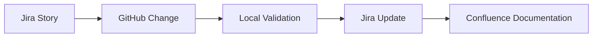

# ENTERPRISE AI DELIVERY
### Selected work in AI-enabled delivery, agent workflows and Atlassian-based project environments

**Technology Leadership · Commercial Responsibility · Enterprise Delivery · AI Transformation**

### Paulo Silva
**Technology & Commercial Leader · Project / Program Delivery · Business Development · AI-enabled Transformation**

---

## About this portfolio

This repository is a **public, non-confidential overview of work I have actually carried out** in AI-enabled project delivery and digital transformation.

The detailed repositories, source code, prompts, internal configurations, Jira structures and implementation details of the underlying projects remain private. The purpose here is to show the **scope, working approach and technologies used** without publishing proprietary know-how.

---

## Professional background

My career combines technical leadership, project and program delivery, consulting and commercial responsibility.

| Area | Experience |
|---|---|
| **Technology Leadership** | Head of Development, Head of R&D and Technical Director / CTO responsibilities in industrial and technology environments |
| **People Leadership** | Line and functional leadership of development and delivery organizations, including teams of around 40–50 professionals |
| **Project & Program Delivery** | Complex software, cloud, engineering and transformation programs in international environments |
| **Customer & Commercial** | Key Account Management, Business Development, customer-facing solution development, proposals, negotiations and follow-up business |
| **Consulting & Transformation** | Senior consulting / management roles in digital and agile transformation, governance and delivery improvement |
| **Business Qualification** | Certified Technical Business Economist (IHK), DQR/EQF Level 7 |
| **Sales Qualification** | Certified Sales Leader / Zertifizierter Vertriebsleiter |
| **Current AI Focus** | AI Management, Digital Automation with AI, Prompt Engineering, Emerging Technologies, Machine Learning and practical AI projects |

---

# Selected AI & Delivery Work

The examples below are based on real project environments I built and used. They are intentionally summarized.

## 1 · SignalDesk Agent Lab — AI-assisted software delivery

**Private reference project**

SignalDesk Agent Lab is a local development and automation workspace I built to explore AI-assisted delivery workflows across **Jira, Confluence, GitHub and local agent tooling**.

Work covered:

- backlog analysis
- sprint preparation
- Jira issue review
- code-generation experiments
- Git-based change tracking
- documentation updates
- delivery-governance support

SignalDesk itself is a B2B enterprise SaaS concept focused on **risks, escalations, decisions and actions in complex organizations**.

> Public detail is deliberately limited. Source code, agent configuration and internal project structure remain private.

[Read the public project summary →](examples/signaldesk.md)

---

## 2 · ProfileHub — end-to-end delivery-chain validation

**Private reference project**

ProfileHub is a separate React/Vite project for a modern personal CV and consulting landing page. I used the project specifically to validate a smaller, controlled delivery chain before applying the approach to larger agent-driven work.

The implemented delivery flow is:

The project uses separate Jira, Confluence and GitHub workspaces, with GitHub as the source for code and Confluence for documentation / playbook content.

[Read the public project summary →](examples/profilehub.md)

---

## 3 · GreenWear AI Service Assistant — AI project with governance and testing

**Practical AI project / professional training**

GreenWear is a multilingual AI customer-service assistant project developed as part of my AI Management qualification.

The project environment uses:

| Tool | Purpose in the project |
|---|---|
| **Jira** | Backlog, epics, tasks, status and timeline |
| **Confluence** | Governance, guardrails and project results |
| **Atlassian Rovo** | Cross-project search and access to Jira / Confluence knowledge |
| **GitHub** | Versioning of prompt, knowledge base and test material |
| **ChatGPT** | Running chatbot prototype |

The working approach includes versioned changes, documented governance and **human handover for uncertain or critical cases**.

[Read the public project summary →](examples/greenwear.md)

---

# What these projects demonstrate

These projects are different in scope, but together they show practical experience with:

- **Jira and Confluence as delivery and governance platforms**
- **Atlassian Rovo for knowledge access across Jira and Confluence**
- **Git / GitHub for versioned technical work and traceability**
- AI-assisted backlog, documentation and development workflows
- local agent experimentation
- structured human review and escalation
- separation of project workspaces and sources of truth
- connecting project-management workflows with engineering delivery

The detailed implementation remains private by design.

---

# Why this matters in my work

My background is not limited to AI tooling. I have spent more than 25 years working at the intersection of **technology, delivery, leadership and customers**.

That means I look at AI-enabled delivery from several perspectives at once:

**business requirement → customer / stakeholder alignment → delivery structure → technical implementation → governance → measurable result**

This is also why I actively combine modern AI tooling with established delivery platforms rather than treating AI as an isolated layer.

---

## Public portfolio boundaries

To protect project know-how, this repository does **not** publish:

- source code from private projects
- credentials or API configuration
- customer or company-confidential information
- detailed prompts or agent instructions
- internal Jira / Confluence content
- infrastructure configuration
- proprietary automation logic

Only high-level, factual summaries of completed or actively developed work are shown here.

---

### TECHNOLOGY · DELIVERY · COMMERCIAL THINKING · AI

**Build practical solutions. Keep the important details protected.**

