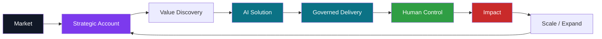
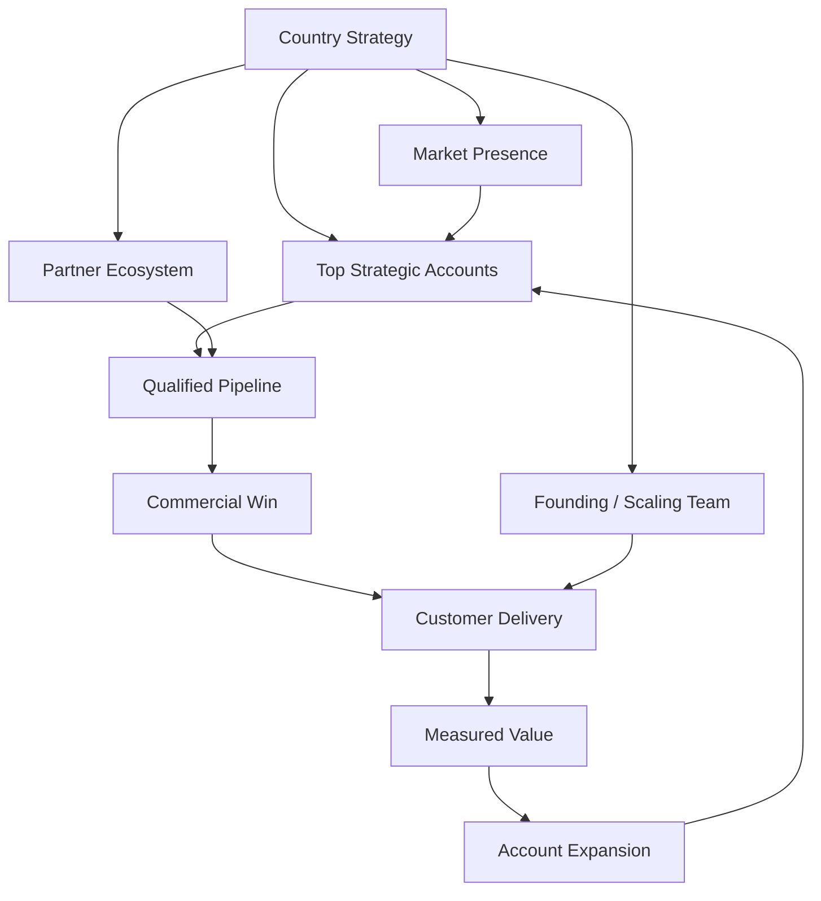
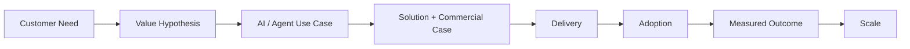
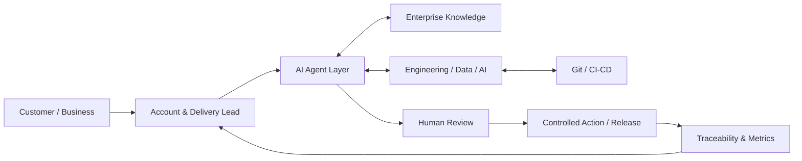
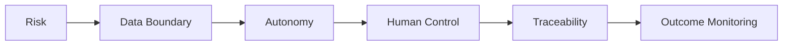
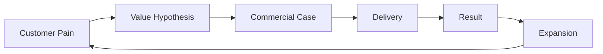
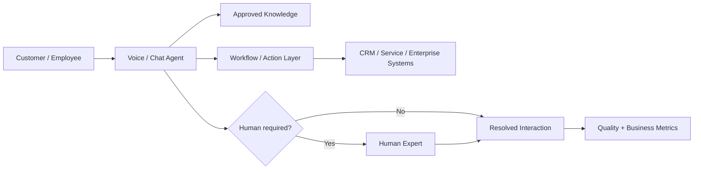

# ENTERPRISE AI DELIVERY
## Build the market. Win the account. Deliver the value. Scale the impact.

**Technology × Commercial Leadership × Enterprise Delivery × AI**

### Paulo Silva
**Technology & Commercial Leader · Enterprise AI · Strategic Accounts · Transformation & Delivery**

---

## The proposition

Enterprise AI is not won by the best demo alone.

It is won when a company can connect:

**market opportunity → executive customer dialogue → commercial case → technical solution → governed delivery → adoption → measurable value → expansion**

> ### **AI is not the destination. A better business outcome is.**

---

# What I bring

I combine areas that are often separated into different functions:

| Leadership dimension | Experience / focus |
|---|---|
| **Technology Leadership** | Development / R&D leadership, CTO-level responsibility, complex technical organizations |
| **Commercial Leadership** | Key Account Management, Business Development, solution selling, proposals, negotiations and follow-up business |
| **Enterprise Delivery** | Programs, projects, transformations, governance, customer delivery and executive stakeholder management |
| **People Leadership** | Building, leading and developing multidisciplinary teams |
| **AI & Automation** | AI management, agentic workflows, digital automation, LLM-based delivery models |
| **Business Management** | Certified Technical Business Economist (IHK), DQR/EQF Level 7 |
| **Sales Leadership** | Certified Sales Leader / Vertriebsleiter qualification |

### In one sentence

> **I connect enterprise customers, commercial opportunity and technical delivery — from first strategic conversation through implementation and adoption to account growth.**

---

# The Country / GM lens

A country business needs more than pipeline and more than delivery. It needs one operating rhythm connecting both.

### What I would optimize

- **Top-account quality**, not vanity pipeline volume
- executive relationships backed by technical credibility
- fast time-to-first-value
- sales promises that can actually be delivered
- repeatable implementation patterns
- partner leverage where it accelerates reach or delivery
- evidence-led account expansion
- clear KPIs across pipeline, delivery, adoption and growth

➡️ See the full **[Country Market Build Playbook](docs/country-market-build-playbook.md)**.

---

# Enterprise AI operating model

Four questions stay connected from start to finish:

| Lens | Question |
|---|---|
| **Commercial** | Is this problem worth solving and capable of creating sustainable value? |
| **Technology** | What architecture and AI capability best fit the problem? |
| **Delivery** | How do we make the solution reliable, adoptable and scalable? |
| **Governance** | Where must human decision authority remain explicit? |

➡️ **[Enterprise AI Operating Model](docs/enterprise-ai-operating-model.md)**

---

# Agentic delivery — humans and AI as one system

Possible components include **Jira, Confluence, Atlassian Rovo, Git/CI/CD, LLMs, specialized agents and enterprise business systems**.

The goal is not to remove people from the process. The goal is to remove unnecessary coordination work while keeping **decision authority, traceability and accountability** clear.

➡️ **[Agentic Delivery Architecture](docs/agentic-delivery-architecture.md)**

---

# Autonomy should follow risk

| Level | Agent behavior | Human role |
|---|---|---|
| **L0** | retrieve / summarize | human decides |
| **L1** | recommend / draft | human approves |
| **L2** | execute low-risk tasks within rules | human handles exceptions |
| **L3** | autonomous within explicit policy boundaries | human governs and audits |

➡️ **[Governance & Risk](docs/governance-and-risk.md)**

---

# Commercial value — the sale and delivery are one loop

### My principle

> **Sell what can be delivered. Deliver what creates value. Use evidence to earn the right to expand.**

➡️ **[Commercial Value Framework](docs/commercial-value-framework.md)**

---

# Conversational & Agentic AI example

A conversational AI solution becomes an enterprise solution only when the model is connected to knowledge, workflows, systems, human escalation and measurable outcomes.

➡️ **[Worked Enterprise Conversational AI Example](examples/enterprise-ai-use-case.md)**

---

# Ready-to-use strategic account tool

For AI opportunity discovery, I use a structure that forces business, technical, governance and commercial questions into the same conversation.

➡️ **[Strategic Account AI Discovery Template](templates/strategic-account-ai-discovery.md)**

It covers:

- customer problem and cost of doing nothing
- measurable value hypothesis
- AI capability and enterprise integrations
- autonomy and human controls
- delivery feasibility
- commercial and expansion logic
- explicit pursue / reshape / stop decision

---

# Portfolio map

| Area | Artifact |
|---|---|
| **Country / GM Execution** | [Country Market Build Playbook](docs/country-market-build-playbook.md) |
| **AI Operating Model** | [Enterprise AI Operating Model](docs/enterprise-ai-operating-model.md) |
| **Agentic Architecture** | [Agentic Delivery Architecture](docs/agentic-delivery-architecture.md) |
| **Governance** | [AI Governance & Risk](docs/governance-and-risk.md) |
| **Commercial** | [Commercial Value Framework](docs/commercial-value-framework.md) |
| **Customer Use Case** | [Conversational / Agentic AI Example](examples/enterprise-ai-use-case.md) |
| **Practical Template** | [Strategic Account AI Discovery](templates/strategic-account-ai-discovery.md) |

---

## About this portfolio

This repository is intentionally public and non-confidential. It demonstrates **how I structure and connect enterprise AI, strategic accounts, delivery and governance** based on my experience in technology leadership, customer-facing programs, consulting, business development and current AI work.

It does **not** claim that every reference pattern shown here has been deployed unchanged in production. Private project repositories and proprietary implementation details remain private by design.

---

# BUILD TRUST · DELIVER VALUE · SCALE INTELLIGENTLY

### Enterprise AI is a leadership challenge as much as a technology challenge.

