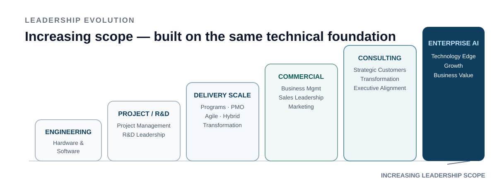
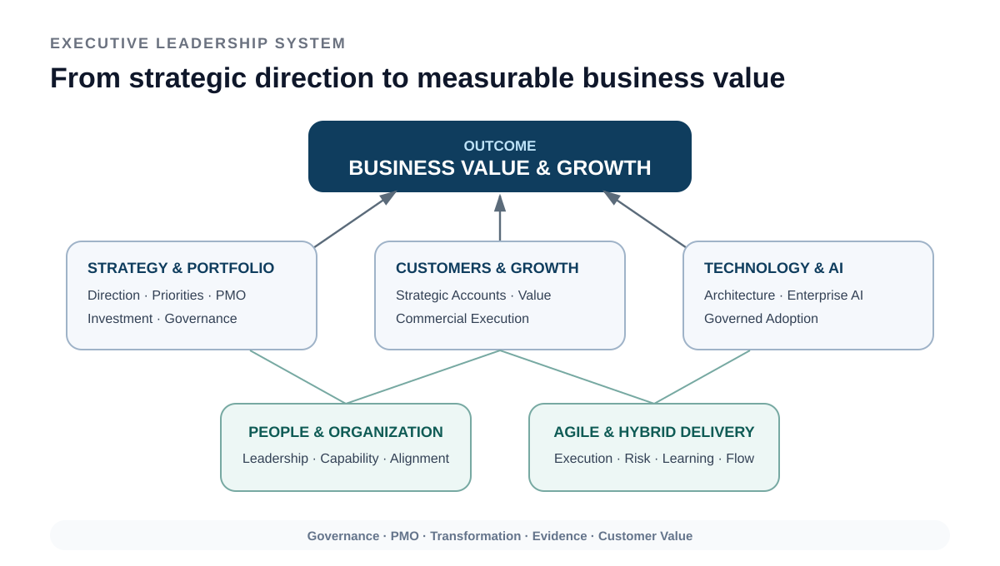
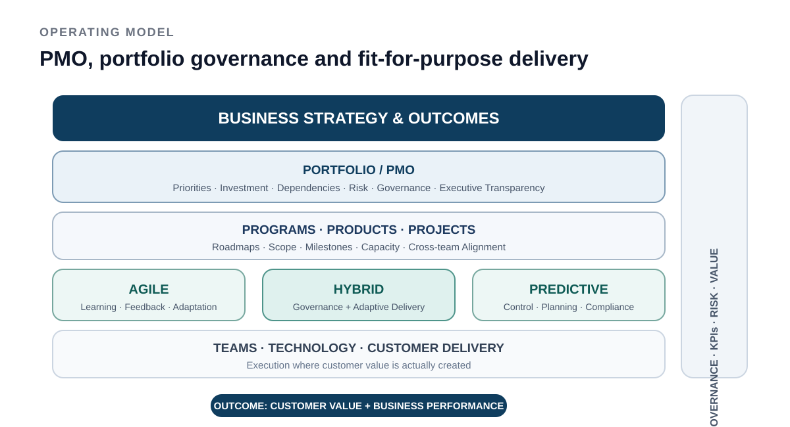

<div align="center">

# ATLASSIAN · AGILE · DIGITALIZATION & AI

### Executive portfolio for digital processing, consulting, customer growth and delivery leadership

**Atlassian Platform & Portfolio Leadership · Agile & Hybrid Transformation · Digitalization & Automation · Enterprise AI & Agents · PMO & Economic Governance · Customer Growth**

[](#atlassian--agile--ai--core-expertise)
[](#atlassian--agile--ai--core-expertise)
[](#automation-data--ai)
[](#leadership-scope)

### Paulo Silva
**Senior Technology, Transformation & Delivery Leader · Atlassian · Agile & Hybrid · Digitalization & AI**

**Core practical expertise:** Atlassian ecosystem · Agile / Hybrid transformation · PMO & delivery governance · digital workflow automation · applied Enterprise AI & agents  
**Leadership & business:** People leadership · economic steering · customer development · consulting · portfolio growth  
**Strategic market perspective:** ServiceNow · OpenText · Microsoft Power Platform · Snowflake · Databricks · Fabric / Power BI

</div>

---

# Executive Positioning

I bring more than **25 years of leadership, technology, transformation and customer-facing delivery experience** across international, regulated and technology-driven environments.

My career developed from **hardware and software development** into **project and program leadership, R&D management, Enterprise PMO / portfolio governance, Agile and Hybrid-Agile transformation, consulting, business development and commercial responsibility**.

The center of gravity of my current profile is the combination of **Atlassian, Agile / Hybrid delivery, digitalization / automation and applied Enterprise AI**. I connect platform capability, operating models, governance and AI-enabled automation with the realities of programs, teams, customers and business performance.

In leadership roles, I have managed **technical organizations with up to 40 employees in direct disciplinary and functional responsibility** and carried responsibility for **50+ professionals in larger distributed delivery environments**. My scope has included people development, resource and capacity planning, budget and cost steering, forecasting, governance, management reporting, escalations, standards and cross-functional collaboration.

My strongest contribution is where **people, economic responsibility, customer development, portfolio priorities, technology choices and delivery execution** have to work as one system.

<p align="center">
  
</p>

---

# Atlassian · Agile · AI — Core Expertise

This is the strongest practical technology and transformation focus of my current profile.

| Core area | Practical expertise |
|---|---|
| **Atlassian Platform** | Jira, Jira Service Management, Confluence and Rovo across delivery, service workflows, governance, knowledge, reporting and collaboration |
| **Agile & Hybrid Transformation** | Scrum, Kanban and Hybrid-Agile operating models; backlog and flow management; program / PMO integration; governance; coaching; adoption and continuous improvement |
| **Enterprise AI & Agents** | governed AI-enabled automation, agentic workflows, AI-assisted delivery, human review, traceability, orchestration patterns and controlled LLM integration |
| **Atlassian AI / Rovo** | knowledge access, work-context assistance, workflow support, decision support and agent-enabled productivity in the Atlassian environment |
| **Delivery Engineering** | Git / CI/CD, AI-assisted delivery workflows, controlled change flows and traceable integration between work management and engineering execution |
| **Portfolio & Governance** | roadmaps, dependencies, risks, KPIs, capacity, executive transparency and PMO integration across Agile and Hybrid delivery environments |

My practical objective is not tool deployment for its own sake. It is to create an integrated operating model where:

> **Atlassian provides the work and knowledge context · Agile provides the delivery system · AI provides governed acceleration**

That combination supports **faster delivery, better transparency, scalable standards, stronger knowledge reuse and new customer-facing services**.

Selected practical evidence: [SignalDesk →](examples/signaldesk.md) · [ProfileHub →](examples/profilehub.md) · [GreenWear →](examples/greenwear.md)

---

# Atlassian Portfolio Development & Digital Services

I see Atlassian not only as a delivery platform, but as a **service and consulting portfolio** that can be expanded through Agile operating models, workflow digitalization, Rovo and governed AI-enabled automation.

A sustainable platform portfolio does not stop at implementation. It connects **consulting, platform design, adoption and change with service operations, measurable performance, continuous improvement and customer expansion**.

```text
Customer Need
      ↓
Consulting & Process Analysis
      ↓
Agile / Hybrid Operating Model
      ↓
Jira · JSM · Confluence
      ↓
Rovo · Automation · Agents
      ↓
Governance · Standards · Adoption
      ↓
Service Delivery · Continuous Improvement
      ↓
Evidence · Expansion · Follow-up Business
```

From a portfolio-leadership perspective, the objective is to:

- translate customer problems into **repeatable Atlassian and digitalization offerings**,
- standardize platform, workflow and governance patterns where standardization creates scale,
- connect Jira / JSM / Confluence with Agile, PMO and delivery governance rather than treating them as isolated tools,
- use Rovo, automation and agents where they create measurable productivity or service value,
- embed change, enablement and training into adoption instead of stopping at implementation,
- manage delivery quality, service performance and economic outcomes transparently,
- turn successful delivery into **referenceable evidence, portfolio growth and additional customer business**.

The leadership challenge is therefore not only to deliver projects successfully, but to turn successful patterns into **repeatable services with transparent economics, scalable standards and long-term customer value**.

This is where my **Atlassian expertise, Agile transformation background, PMO governance, commercial experience and applied AI work** reinforce each other.

---

# Leadership Scope

<p align="center">
  
</p>

| Responsibility | Executive contribution |
|---|---|
| **People & Organization** | lead technical organizations, develop specialists and leaders, conduct structured performance and development dialogue, create accountability and build scalable delivery capability across distributed teams |
| **Business & Economic Responsibility** | translate strategic goals into priorities, capacity and resource plans; steer budgets, forecasts, KPIs, costs and corrective measures; create management transparency |
| **Customers & Consulting** | build executive trust, understand business problems, translate requirements into technical and commercial solutions and connect customer demand with sustainable services |
| **Portfolio & Offerings** | develop and prioritize Atlassian, Agile, digitalization, automation, AI and transformation capabilities based on customer value, market relevance and delivery feasibility |
| **Commercial Growth** | support account development, opportunity shaping, proposals, negotiations, follow-up business and expansion of existing customer relationships |
| **Atlassian, Agile & AI** | connect Jira, JSM, Confluence, Rovo, Agile operating models and agentic / AI capabilities with governance, delivery standards and customer-oriented service models |
| **Change, Enablement & Training** | combine change management, coaching, standards, role clarity, enablement and practical training to create sustainable adoption |
| **Service Performance & Lifecycle** | connect implementation with operations, service KPIs, cost-to-serve, continuous improvement, reusable standards and scalable customer services |
| **PMO & Governance** | align roadmaps, dependencies, risks, resources, decisions, KPIs, management reporting and escalation paths across complex portfolios |
| **Delivery & Transformation** | lead programs and projects end-to-end and connect Agile, predictive or hybrid delivery with organizational change and operational adoption |

My strongest contribution is at the interfaces: **business ↔ technology, customer promise ↔ delivery reality, portfolio ambition ↔ organizational capability, and transformation strategy ↔ execution**.

---

# Digital Processing & Consulting Leadership

Digital transformation creates value when consulting, process design, platforms, implementation and operations form one coherent chain.

```text
Business Outcome
      ↓
Customer / Process Analysis
      ↓
Workflow & Standard Design
      ↓
Platform / Tool Selection
      ↓
Implementation & Transformation
      ↓
Adoption / Enablement
      ↓
Service / Operations
      ↓
Continuous Improvement & Growth
```

My leadership perspective across this chain is to:

- clarify the business outcome before selecting technology,
- translate requirements into solutions that are technically credible and commercially viable,
- use **Atlassian and Agile delivery patterns** where they provide the strongest fit for work, service, knowledge and delivery management,
- define and optimize standards for workflows, processes, tools and repeatable delivery,
- connect consulting decisions with implementation and operational feasibility,
- establish transparent governance, service performance and management reporting,
- use automation and AI where they improve productivity, quality, experience or decision-making,
- convert successful delivery patterns into **reusable consulting offers, scalable services and follow-up business**.

---

# PMO, Agile Transformation & Delivery Governance

<p align="center">
  
</p>

I have led complex initiatives across **classical, Agile and Hybrid-Agile environments**. Agile is not a side topic in my profile; it is a core delivery and transformation capability that I connect with PMO, portfolio governance and enterprise platforms.

Key areas include:

- Scrum, Kanban and Hybrid-Agile operating models,
- Agile coaching, role clarity, adoption and continuous improvement,
- portfolio priorities and roadmaps,
- program and project governance,
- backlog, flow, dependencies and delivery transparency,
- resource and capacity transparency,
- budget, forecast and cost awareness,
- risks, escalations and decision boards,
- management and executive reporting,
- KPIs and OKRs,
- stakeholder and supplier governance,
- methods, standards, change and value realization.

The principle is simple: **govern the outcomes, dependencies, risks and decisions — not every task**.

[PMO, Transformation & Delivery Governance evidence →](examples/pmo-transformation-delivery-governance.md)

---

# Automation, Data & AI

AI is a strategic extension of the broader digital-platform and automation portfolio — and a practical capability in my current work.

Alongside my strong Atlassian and Agile experience, I have built practical capability in **governed AI-enabled and agentic workflow automation**. This includes applied work around **AI-assisted delivery workflows, agentic patterns, human review, traceability, local / sovereign AI approaches and controlled integration of LLM-based tooling** into enterprise delivery contexts.

My practical focus is on:

- Atlassian Rovo and AI-enabled work-context use cases,
- governed automation and human control,
- agentic workflows and orchestration patterns,
- AI-enabled Agile and PMO delivery support,
- AI-assisted engineering / coding workflows connected to Git / CI/CD,
- traceability, reviewability and operational reliability,
- disciplined use of tools, platforms and API cost,
- business value rather than automation for its own sake.

## Current AI & Digital Transformation Qualification — completion September 2026

My applied AI work is reinforced by a current professional qualification focused on the capabilities most relevant to enterprise digitalization, automation and AI-enabled delivery.

| Qualification area | Status |
|---|---|
| **AI Management** | completed |
| **Emerging Technologies / Digital Transformation** | completed |
| **Prompt Engineering** | completed |
| **Machine Learning** | in progress |
| **Digital Automation with AI / Process Optimization** | in progress |

**Planned completion:** end of **September 2026**.

In parallel, I maintain a **market and portfolio view** of how ServiceNow, OpenText, Snowflake, Databricks, Microsoft Fabric / Power BI and enterprise AI services are evolving and increasingly interacting.

Selected evidence: [Enterprise AI Platform Advisory →](examples/ai-platform-advisory.md) · [Applied Prompt Engineering →](examples/applied-prompt-engineering.md) · [SignalDesk →](examples/signaldesk.md)

---

# Customer & Commercial Growth

Technology leadership becomes business leadership when customer value, delivery quality and commercial development are managed together.

<p align="center">
  
</p>

My commercial experience includes **Key Account Management, Business Development, Solution Management, customer-facing solution development, proposals, commercial negotiations, account development and follow-up business**.

A recurring part of my work has been to translate **customer requirements into technically credible and commercially viable solutions**, support proposals and follow-up business, and develop customer relationships across the full delivery lifecycle.

For Atlassian, Agile, digitalization and AI-enabled transformation topics, this means connecting technical credibility with consulting-led growth:

```text
Customer Problem → Opportunity → Solution → Business Case
        → Delivery → Service → Evidence → Expansion
```

Trusted delivery and reliable service performance create the evidence for **expansion, additional services and long-term customer value**.

My formal commercial foundation includes the **Technischer Betriebswirt IHK / Certified Technical Business Economist at DQR/EQF Level 7**, complemented by **Sales Leader / Vertriebsleiter**, **Change Manager** and **Online Marketing Manager** qualifications.

[Commercial strategy case →](examples/commercial-strategy-smart-energy.md)  
[Sales Leadership foundation →](background/sales-leadership-foundation.md)  
[Selected business & commercial qualifications →](background/selected-business-commercial-qualifications.md)

---

# Enterprise Platform Market Perspective

My core expertise is **Atlassian + Agile + applied Enterprise AI**. Around that core, I maintain a strategic market and portfolio perspective on adjacent enterprise platforms.

| Portfolio area | Perspective |
|---|---|
| **Atlassian** | core practical expertise: Jira, Jira Service Management, Confluence, Rovo, Agile / product delivery, work management, governance and AI-enabled delivery contexts |
| **Enterprise AI & Agents** | core practical and strategic expertise across governed automation, agentic workflows, AI-enabled delivery, orchestration patterns, interoperability, private / sovereign AI and human control |
| **ServiceNow** | strategic market and portfolio perspective across enterprise service management, workflow, CMDB, automation and AI-enabled service operations |
| **OpenText** | strategic market and portfolio perspective across service management, enterprise information, AIOps, software delivery / quality and regulated operating environments |
| **Microsoft Power Platform** | strategic market and solution perspective on business process automation, low-code workflows, integration and user-centric digitalization |
| **Snowflake / Databricks / Fabric + Power BI** | strategic view of data, analytics, AI engineering, semantic intelligence and how these platforms support enterprise decision-making and AI-enabled services |

The leadership question is not **“Which vendor wins?”** It is:

> **Which platform should play which role for which customer, process, operating model and business outcome?**

---

# Selected Executive Evidence

This portfolio combines **Atlassian and Agile delivery evidence, applied Enterprise AI, PMO / governance, platform advisory, commercial strategy and leadership operating models**.

| Evidence | What it demonstrates |
|---|---|
| **[SignalDesk](examples/signaldesk.md)** | AI-assisted PMO and delivery workflows across Jira, Confluence and GitHub; management visibility, risks, escalations, decisions and actions |
| **[PMO, Transformation & Delivery Governance](examples/pmo-transformation-delivery-governance.md)** | portfolio governance, Agile / Hybrid / Predictive delivery, executive transparency, risk, KPIs and customer-value-oriented operating models |
| **[ProfileHub](examples/profilehub.md)** | controlled end-to-end delivery chain from work item through implementation, local validation and evidence |
| **[GreenWear](examples/greenwear.md)** | multilingual AI service use case combining customer experience, governance, testing, knowledge management and human handover |
| **[Enterprise AI Platform Advisory](examples/ai-platform-advisory.md)** | executive market perspective across Atlassian, ServiceNow, OpenText, Snowflake, Databricks, Fabric / Power BI and enterprise AI |
| **[Applied Prompt Engineering](examples/applied-prompt-engineering.md)** | structured use of generative AI across customer support, content, data analysis and software work with quality and governance controls |
| **[Commercial Strategy & Go-to-Market](examples/commercial-strategy-smart-energy.md)** | market potential, segmentation, customer value, positioning, commercial objectives, KPIs and channels |
| **[First 100 Days — Digital Services & Portfolio Leadership](examples/first-100-days-digital-services-portfolio-leadership.md)** | adaptive leadership across people, customers, portfolio, economics, Atlassian/Agile, service performance and evidence-based scale |
| **[Enterprise Opportunity Leadership](examples/how-i-would-structure-an-enterprise-ai-opportunity.md)** | customer problem, business value, feasibility, governance, implementation, adoption, evidence and expansion |

Together, these examples show how I combine **Atlassian, Agile, AI, leadership, economic governance, customer development and delivery execution** rather than treating them as isolated disciplines.

---

# Professional Foundation & Qualifications

### Atlassian, Agile & Enterprise AI
- **Atlassian Rovo Fundamentals**
- **Atlassian Forge Fundamentals**
- **Atlassian Loom Fundamentals**
- **Professional Scrum Master II (PSM II)**
- **Professional Scrum Master I (PSM I)**
- **Professional Scrum Product Owner I (PSPO I)**
- **PRINCE2 Agile**
- **AI Management**
- **Emerging Technologies / Digital Transformation**
- **Prompt Engineering**
- **Machine Learning** *(in progress)*
- **Digital Automation with AI / Process Optimization** *(in progress)*

### Business, Commercial & Leadership
- **Certified Technical Business Economist (IHK), Master level — DQR/EQF Level 7**
- **Certified Sales Leader / Vertriebsleiter**
- **Change Manager**
- **Online Marketing Manager**
- **SAP Sales / Sales Order Processing**

### Project, Program, PMO & Operational Excellence
- **PRINCE2 Foundation**
- **Project Management / Software Project Management**
- extensive **PMO / Portfolio Governance** experience
- **Six Sigma Black Belt**
- **Lean Manager**
- **Lean / Six Sigma Project Specialist**
- **Lean / Six Sigma Trainer**
- **Process Management**

---

# Leadership Principles

- **Atlassian as a platform and service portfolio, not just a toolset**
- **Agile as an operating system for delivery, not a ceremony framework**
- **AI as governed acceleration, not uncontrolled automation**
- **digitalization starts with the business process, not the tool**
- **economic responsibility is part of technology leadership**
- **people development and accountability create scalable capability**
- **customer value and portfolio growth belong together**
- **fit-for-purpose delivery instead of methodology dogma**
- **transparent governance without micromanagement**
- **commercial scalability as part of service design**
- **operate, improve and scale beyond implementation**
- **evidence before scale**

---

<div align="center">

### ATLASSIAN · AGILE · DIGITALIZATION · ENTERPRISE AI · CUSTOMER GROWTH

**Lead people. Steer performance. Transform delivery. Apply AI with control. Grow customer value.**

</div>

<!-- acronym-legend:start -->
> **Terminology on this page**  
> **AI** — Artificial Intelligence · **AIOps** — Artificial Intelligence for IT Operations · **API** — Application Programming Interface  
> **BI** — Business Intelligence · **CI/CD** — Continuous Integration / Continuous Delivery · **CMDB** — Configuration Management Database  
> **KPI** — Key Performance Indicator · **LLM** — Large Language Model · **OKR** — Objectives and Key Results · **PMO** — Project Management Office
<!-- acronym-legend:end -->
