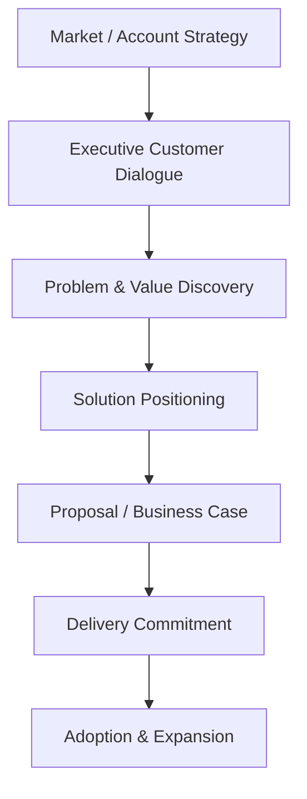
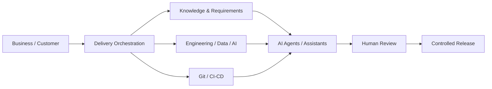
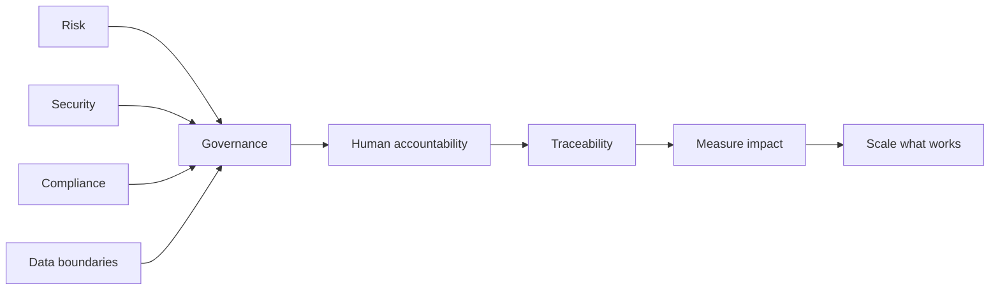
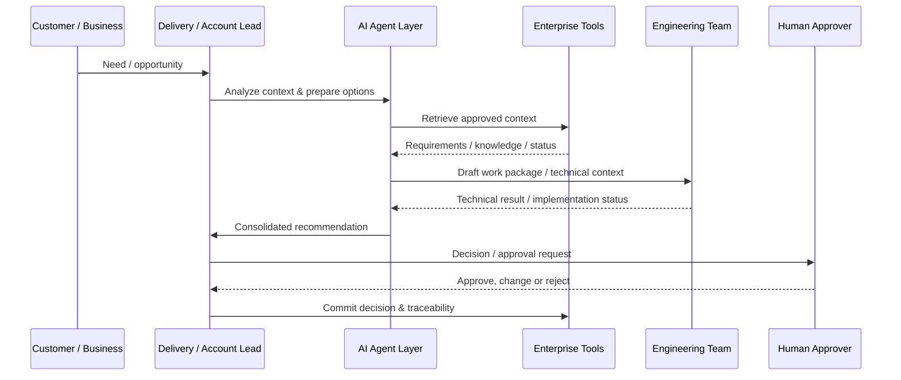
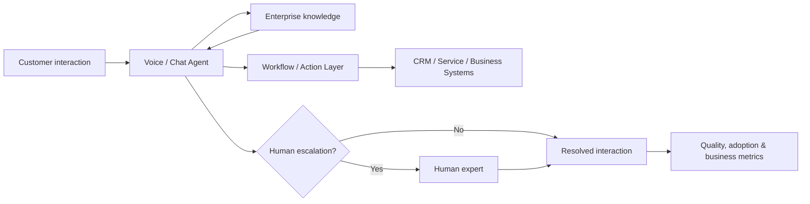

# ENTERPRISE AI DELIVERY
### From AI opportunity to governed enterprise impact

**Technology × Commercial Leadership × Delivery × Adoption**

**Paulo Silva**  
Technology & Commercial Leader · Enterprise AI · Strategic Accounts · Transformation & Delivery

---

## The idea

Enterprise AI creates value only when **technology, customer need, commercial viability, delivery and adoption** work as one system.

This repository is a public portfolio of the operating principles and reference patterns I use to think about AI-enabled enterprise delivery. It is intentionally technology-aware but **not technology-led**: the starting point is the business problem, and the finish line is measurable impact.

> **AI is not the destination. A better business outcome is.**

---

## The operating model

The model combines four perspectives that are too often separated:

| Perspective | Core question |
|---|---|
| **Commercial** | Is this a problem worth solving, and can it create sustainable customer value? |
| **Technology** | What architecture and AI capabilities are appropriate for the problem? |
| **Delivery** | How do we move from idea to reliable implementation with clear ownership? |
| **Governance** | Where must humans stay in control, and how do we make decisions traceable? |

---

## My profile in one line

**I connect enterprise customers, technical teams and commercial outcomes — from strategic opportunity through solution design and delivery to adoption and account growth.**

My background combines:

- 25+ years in international technology, engineering, transformation and delivery environments
- Leadership roles including development / R&D leadership, CTO-level responsibility, project & program leadership and consulting
- Key Account Management, Business Development, solution selling, proposals, negotiations and customer development
- Certified Sales Leader / Vertriebsleiter qualification
- Certified Technical Business Economist (IHK), DQR/EQF Level 7
- Current focus on AI management, digital automation, agentic workflows and AI-enabled delivery
- Hands-on work with Jira, Confluence, Atlassian Rovo, Git / CI/CD and LLM / agent patterns

---

# Three layers of Enterprise AI Delivery

## 1 · CUSTOMER & COMMERCIAL

**What matters:** strategic accounts, value discovery, trusted-advisor credibility, commercial clarity, follow-up business.

## 2 · DELIVERY & ENGINEERING

A practical toolchain can include **Jira, Confluence, Rovo, Git/CI/CD, LLMs and specialized agents**, while preserving explicit human decision points.

## 3 · GOVERNANCE & SCALE

The goal is **not maximum automation**. The goal is the right automation, with the right controls, at the right economic point.

---

# Agentic Delivery Reference Pattern

A useful agentic model separates **decision authority** from **automation capability**.

### Design principles

1. **Business context before model choice**
2. **Human accountability stays explicit**
3. **Source systems remain systems of record**
4. **Agents orchestrate work; they do not erase governance**
5. **Every automation should have a measurable economic reason to exist**
6. **Enterprise adoption is part of delivery, not an afterthought**

---

# Example: Conversational / Agentic Enterprise AI

A customer-facing AI initiative can be framed beyond the model itself:

Key leadership questions:

- Which interactions genuinely benefit from AI?
- Which enterprise systems must be integrated?
- What is the acceptable autonomy level?
- Where is human escalation mandatory?
- How are quality, latency, cost and conversion measured?
- How does a successful first deployment become repeatable account growth?

---

# What I optimize for

| Dimension | Target state |
|---|---|
| **Customer** | Trust, relevance, adoption |
| **Commercial** | Clear value case, sustainable growth |
| **Delivery** | Ownership, speed, predictability |
| **Technology** | Appropriate architecture, integration, reliability |
| **AI** | Useful intelligence, not novelty |
| **Governance** | Human accountability and traceability |
| **Scale** | Reusable patterns instead of repeated reinvention |

---

# Portfolio map

Explore the deeper material in this repository:

- [`docs/enterprise-ai-operating-model.md`](docs/enterprise-ai-operating-model.md) — from strategic account opportunity to scale
- [`docs/agentic-delivery-architecture.md`](docs/agentic-delivery-architecture.md) — reference architecture for human + agent + engineering collaboration
- [`docs/governance-and-risk.md`](docs/governance-and-risk.md) — practical governance guardrails
- [`docs/commercial-value-framework.md`](docs/commercial-value-framework.md) — connecting AI initiatives to revenue, adoption and measurable value
- [`examples/enterprise-ai-use-case.md`](examples/enterprise-ai-use-case.md) — worked example without proprietary data

---

## Why this repository exists

This is **not a claim that every architecture shown here is deployed unchanged in production**. It is a public, non-confidential portfolio demonstrating how I structure enterprise AI opportunities and delivery models based on my background in technology leadership, program delivery, consulting, commercial responsibility and current AI work.

Private project repositories remain private by design.

---

### Build trust. Deliver value. Scale intelligently.

**Enterprise AI is a leadership challenge as much as a technology challenge.**

