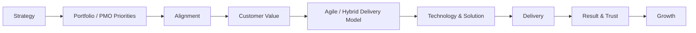

# ENTERPRISE AI · COMMERCIAL GROWTH · DELIVERY LEADERSHIP
### Executive portfolio across market strategy, strategic customers, PMO, technology and transformation

**Leadership · Commercial Growth · Strategic Accounts · PMO & Portfolio Governance · Enterprise AI · Agile & Hybrid Delivery**

### Paulo Silva
**Technology & Commercial Leader · Enterprise AI · Strategic Customers · PMO · Agile & Hybrid Transformation & Delivery**

---

# Executive Positioning

Companies do not need a Lead simply to manage activity. They need someone who can **set direction, create alignment, make decisions, develop people, win customer trust and turn strategy into measurable results**.

That is where my background is strongest. I combine deep technology and engineering understanding with project/program leadership, **PMO and portfolio governance**, R&D management, **Agile and hybrid delivery**, transformation expertise, commercial leadership and business management.

My career started in **hardware and software development**, progressed through **project management and R&D leadership**, expanded into **PMO / portfolio steering, Agile, hybrid delivery and transformation**, and was deliberately strengthened with commercial qualifications in **Sales Leadership, Technical Business Management and Online Marketing**. In consulting and management roles, I have brought these perspectives together across complex customer, portfolio and delivery environments.

Today, I use that breadth to connect the **edge of technology — particularly Enterprise AI and agentic workflows — with real business value, customer growth and executable delivery**.

> **Engineering depth → Project / Program & PMO Leadership → Agile & Hybrid Delivery → Commercial understanding → Transformation → Enterprise AI → Business value**

The value I bring as a Lead is the ability to connect **strategy, customers, people, portfolio priorities, technology and execution** rather than optimize each in isolation.

---

# What I Bring as a Lead

| Leadership responsibility | What I bring |
|---|---|
| **Direction & Prioritization** | translate business goals into clear priorities, operating models, roadmaps and measurable outcomes |
| **People & Organization** | lead and develop teams, create accountability, coach leaders and specialists, and build capability across distributed organizations |
| **Customers & Commercial Growth** | build executive trust, develop strategic accounts, shape value propositions, support negotiations and connect customer needs to growth opportunities |
| **PMO & Portfolio Governance** | establish portfolio transparency, governance and management cadence across initiatives; align roadmaps, dependencies, risks, priorities, resources, KPIs and executive reporting |
| **Agile & Hybrid Delivery Ownership** | lead complex projects and programs end-to-end, select fit-for-purpose Agile, predictive or hybrid delivery models, manage dependencies and risks, establish governance and keep execution focused on outcomes |
| **Technology & Enterprise AI** | assess technology pragmatically, connect architecture and delivery reality with business value, and introduce AI with governance and human control |
| **Transformation & Change** | move organizations from strategy to adoption by aligning stakeholders, processes, tools, behaviors and decision structures |
| **Business Value & Performance** | combine technology decisions with economic logic, customer value, KPIs and evidence-based investment and scaling decisions |

This combination allows me to operate where many leadership challenges actually sit: **between business and technology, between portfolio priorities and delivery capacity, between customer promise and delivery reality, and between strategic intent and operational execution**.

---

# Selected Executive Evidence

## 1 · Commercial Strategy & Go-to-Market
### Smart-energy technology

I developed an end-to-end **sales strategy and sales concept for a new technology product** as part of my formal Sales Leader qualification.

The work connected:

**business direction → market potential → segmentation → customer buying motives → competitive position → value proposition → target groups → sales strategy → KPIs → communication → channels**

This is a factual project summary. Pricing, forecasts and company-confidential details remain private.

[Commercial strategy case →](examples/commercial-strategy-smart-energy.md)

---

## 2 · Enterprise AI & Delivery
### SignalDesk · ProfileHub · GreenWear

I use practical reference environments to explore how AI can improve enterprise delivery without losing governance, traceability or human control.

Across the projects, I have worked with combinations of:

**Jira · Confluence · Rovo · GitHub · AI agents · local tooling · governed workflows · human review**

The emphasis is not AI experimentation for its own sake. The focus is **how AI can improve decision support, workflow execution, knowledge access, documentation and delivery transparency in real operating environments**.

[SignalDesk →](examples/signaldesk.md) · [ProfileHub →](examples/profilehub.md) · [GreenWear →](examples/greenwear.md)

---

## 3 · General Management Thinking
### Enterprise AI country business — First 100 Days

This is an **illustrative leadership example**, not a claim that I have already held a SaaS country-GM mandate.

It shows how I would structure a new market responsibility around:

**market focus → strategic accounts → customer value → buying dynamics → commercial execution → delivery → team → partners → evidence for scale**

The operating blueprint uses four phases:

**Understand → Position → Execute → Prove & Scale**

[First 100 Days operating blueprint →](examples/how-i-would-build-an-ai-country-business.md)

---

## 4 · Enterprise Opportunity Leadership
### From customer problem to scalable value

A second illustrative example shows how I would structure an Enterprise AI opportunity from first business problem through technical feasibility, governance, implementation, adoption and expansion.

The principle is straightforward:

> **Understand the real problem. Make the value explicit. Keep technology and delivery honest. Prove the result. Then scale.**

[Enterprise AI opportunity approach →](examples/how-i-would-structure-an-enterprise-ai-opportunity.md)

---

# Commercial Leadership

My commercial foundation combines **professional customer responsibility** with formal qualifications in sales leadership, business management and digital marketing.

I have worked across Key Account Management, Business Development, customer-facing solution development, proposals, commercial negotiations, account development and follow-up business.

My formal **Sales Leader / Vertriebsleiter** qualification covered 22 modules plus a practical strategy project, including:

**sales strategy · market segmentation · strategic accounts · customer conversations · negotiation · sales leadership · CRM · digital sales · sales controlling**

My **Online Marketing Manager** qualification adds digital strategy, customer journey, SEO/SEA, email, social media, content, campaign and analytics perspectives.

[Sales Leadership foundation →](background/sales-leadership-foundation.md)  
[Selected business & commercial qualifications →](background/selected-business-commercial-qualifications.md)

---

# Enterprise AI & Digital Transformation

My current professional qualification adds a formal management layer to the hands-on AI work.

**Completed qualifications:**

- **AI Management**
- **AI Management Project Work**
- **Emerging Technologies / Digital Transformation**
- **Prompt Engineering**

The content includes AI strategy, business models, technology assessment, stakeholder management, governance, data ethics, risk management, AI-team setup, change management and practical AI project work.

Further qualification modules are currently in progress.

---

# Platform & Qualification Evidence

Formal qualifications support the broader executive profile across **business, commercial leadership, AI, PMO / portfolio governance, project/program management, Agile & hybrid delivery and transformation**.

### Business, Commercial & Growth

- **Certified Technical Business Economist (IHK), DQR/EQF Level 7**
- **Certified Sales Leader / Vertriebsleiter**
- **Online Marketing Manager**
- **SAP Sales / Sales Order Processing**

### Enterprise AI & Atlassian

- **AI Management**
- **AI Management Project Work**
- **Emerging Technologies / Digital Transformation**
- **Prompt Engineering**
- **Atlassian Rovo Fundamentals**
- **Atlassian Forge Fundamentals**
- **Atlassian Loom Fundamentals**

### Project, Program, PMO & Hybrid Delivery

- **PRINCE2 Agile**
- **PRINCE2 Foundation**
- **Project Management**
- **Software Project Management**
- **PMO / Portfolio Governance experience**

### Agile, Product & Delivery

- **Professional Scrum Master II (PSM II)**
- **Professional Scrum Master I (PSM I)**
- **Professional Scrum Product Owner I (PSPO I)**

### Transformation & Operational Excellence

- **Change Manager**
- **Six Sigma Black Belt**
- **Lean Manager**
- **Lean / Six Sigma Project Specialist**
- **Lean / Six Sigma Trainer**
- **Process Management**

---

# How I Lead Complex Technology Business

The management logic behind this portfolio is consistent:

- **direction before activity**
- **portfolio priorities before local optimization**
- **customer value before product enthusiasm**
- **people and accountability before process overhead**
- **fit-for-purpose Agile, predictive or hybrid delivery instead of methodology dogma**
- **technical credibility before over-promising**
- **few decision-relevant KPIs rather than reporting volume**
- **delivery as part of the commercial relationship**
- **evidence before scale**

This is how I connect leadership, commercial responsibility, PMO / portfolio governance and enterprise technology without treating them as separate disciplines.

---

## Portfolio Integrity

This repository separates clearly between:

**Factual work** — public summaries of work I have actually carried out.  
**Illustrative leadership approaches** — examples showing how I would structure a new mandate.

To protect company, customer and project know-how, I do not publish private source code, credentials, customer information, detailed prompts, internal Jira / Confluence content, account strategies, pricing, negotiation logic, business-plan figures or proprietary implementation details.

---

### LEADERSHIP · COMMERCIAL GROWTH · STRATEGIC CUSTOMERS · PMO · ENTERPRISE AI · AGILE & HYBRID DELIVERY

**Set direction. Align portfolios. Build trust. Deliver value. Scale what works.**

