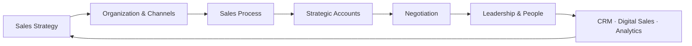
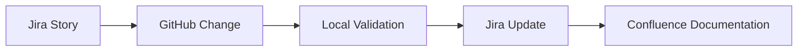
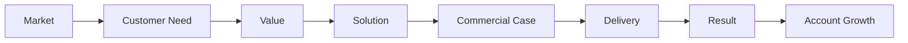

# ENTERPRISE AI · COMMERCIAL LEADERSHIP · DELIVERY
### Selected work across technology, commercial strategy, AI-enabled delivery and transformation

**Technology Leadership · Commercial Leadership · Enterprise Delivery · AI Transformation**

### Paulo Silva
**Technology & Commercial Leader · Strategic Customers · Project / Program Delivery · AI-enabled Transformation**

---

## About this portfolio

This repository has **two clearly separated purposes**:

1. **What I have done** — public, non-confidential summaries of work I have actually carried out.
2. **How I would approach a new challenge** — clearly marked illustrative examples showing how I would structure leadership, commercial and Enterprise AI problems.

The detailed repositories, source code, prompts, internal configurations, company data, business-plan figures, Jira structures and proprietary implementation details remain private. The purpose here is to show **experience, working style and decision logic without publishing the know-how that should remain protected**.

---

## Professional background

My career combines technical leadership, project and program delivery, consulting and commercial responsibility.

| Area | Experience |
|---|---|
| **Technology Leadership** | Head of Development, Head of R&D and Technical Director / CTO responsibilities in industrial and technology environments |
| **People Leadership** | Line and functional leadership of development and delivery organizations, including teams of around 40–50 professionals |
| **Project & Program Delivery** | Complex software, cloud, engineering and transformation programs in international environments |
| **Customer & Commercial** | Key Account Management, Business Development, customer-facing solution development, proposals, negotiations, account development and follow-up business |
| **Consulting & Transformation** | Senior consulting / management roles in digital and agile transformation, governance and delivery improvement |
| **Business Qualification** | Certified Technical Business Economist (IHK), DQR/EQF Level 7 |
| **Sales Qualification** | Certified Sales Leader / Zertifizierter Vertriebsleiter |
| **Current AI Focus** | AI Management, Digital Automation with AI, Prompt Engineering, Emerging Technologies, Machine Learning and practical AI projects |

> **My differentiator is the combination:** I can move between the customer conversation, commercial logic, technical solution, delivery reality and leadership decision without treating them as separate worlds.

---

# Commercial Leadership Foundation

My formal Sales Leader qualification covered the **full commercial operating system**, not only selling techniques: sales strategy, organizational and channel design, sales processes, account strategy, customer conversations, negotiation, sales leadership, recruiting, CRM, digital sales and data-driven sales controlling.

The qualification consisted of **22 modules plus a practical commercial strategy project**.

The most important principle across those areas is simple:

> **Strategy decides where to compete. Customer value decides why a buyer should act. Process and data create transparency. Leadership turns that information into focused execution.**

[See the summarized Sales Leadership foundation →](background/sales-leadership-foundation.md)

---

# Selected Work

The examples below are based on **real work I carried out**. They are intentionally summarized.

## 1 · Commercial Strategy & Go-to-Market — Smart Energy Technology

**Sales Leader qualification project**

I developed an end-to-end **sales strategy and sales concept for a new smart-energy technology product**.

The project connected:

**business context → market analysis → segmentation → customer buying motives → competitor analysis → USP / positioning → sales strategy → objectives & KPIs → communication → sales channels**

The work also used SWOT and Six Sigma / DMAIC to turn analysis into structured commercial actions. Detailed forecasts, pricing and company-confidential figures remain private.

[Read the factual commercial strategy case →](examples/commercial-strategy-smart-energy.md)

---

## 2 · SignalDesk Agent Lab — AI-assisted software delivery

**Private reference project**

SignalDesk Agent Lab is a local development and automation workspace I built to explore AI-assisted delivery workflows across **Jira, Confluence, GitHub and local agent tooling**.

Work covered:

- backlog analysis
- sprint preparation
- Jira issue review
- code-generation experiments
- Git-based change tracking
- documentation updates
- delivery-governance support

SignalDesk itself is a B2B enterprise SaaS concept focused on **risks, escalations, decisions and actions in complex organizations**.

> Public detail is deliberately limited. Source code, agent configuration and internal project structure remain private.

[Read the public project summary →](examples/signaldesk.md)

---

## 3 · ProfileHub — end-to-end delivery-chain validation

**Private reference project**

ProfileHub is a separate React/Vite project for a modern personal CV and consulting landing page. I used the project specifically to validate a smaller, controlled delivery chain before applying the approach to larger agent-driven work.

The implemented delivery flow is:

The project uses separate Jira, Confluence and GitHub workspaces, with GitHub as the source for code and Confluence for documentation / playbook content.

[Read the public project summary →](examples/profilehub.md)

---

## 4 · GreenWear AI Service Assistant — AI project with governance and testing

**Practical AI project / professional training**

GreenWear is a multilingual AI customer-service assistant project developed as part of my AI Management qualification.

The project environment uses:

| Tool | Purpose in the project |
|---|---|
| **Jira** | Backlog, epics, tasks, status and timeline |
| **Confluence** | Governance, guardrails and project results |
| **Atlassian Rovo** | Cross-project search and access to Jira / Confluence knowledge |
| **GitHub** | Versioning of prompt, knowledge base and test material |
| **ChatGPT** | Running chatbot prototype |

The working approach includes versioned changes, documented governance and **human handover for uncertain or critical cases**.

[Read the public project summary →](examples/greenwear.md)

---

# How I Would Approach a New Challenge

The following examples are **not claims of completed past projects**. They are deliberately marked as illustrative and show how I would structure a new mandate based on my leadership, commercial, delivery and technical experience.

## Example A · Building an Enterprise AI country business

How I would connect:

**market segmentation → strategic accounts → customer value → commercial opportunity → delivery → trust → expansion**

The example contains a **First 100 Days Operating Blueprint** built around four phases:

**Understand → Position → Execute → Prove & Scale**

It combines market and account prioritization, customer-value logic, buying-process and stakeholder mapping, a focused KPI system, CRM / evidence discipline, team and partner priorities, commercial and delivery cadence, and evidence-based investment decisions after the first 100 days.

[See the illustrative Country / GM 100-day approach →](examples/how-i-would-build-an-ai-country-business.md)

---

## Example B · Structuring an Enterprise AI opportunity

How I would move from:

**customer problem → measurable value → technical feasibility → focused first use case → governed delivery → adoption → evidence → expansion**

This example shows how I connect business, technical, governance and commercial questions early instead of treating AI as an isolated technology exercise.

[See the illustrative Enterprise AI opportunity approach →](examples/how-i-would-structure-an-enterprise-ai-opportunity.md)

> **Important:** These examples describe how I would work. The four project summaries above describe work I have actually carried out.

---

# What the real work demonstrates

Taken together, the real examples show practical experience with:

- commercial strategy from **market and competitor analysis to segmentation, positioning, objectives, KPIs and sales channels**
- Key Account / Business Development thinking connected to technical solution credibility
- **Jira and Confluence as delivery and governance platforms**
- **Atlassian Rovo for knowledge access across Jira and Confluence**
- **Git / GitHub for versioned technical work and traceability**
- AI-assisted backlog, documentation and development workflows
- local agent experimentation
- structured human review and escalation
- separation of project workspaces and sources of truth
- connecting project-management workflows with engineering delivery

The detailed implementation and commercially sensitive material remain private by design.

---

# How I think about commercial leadership

My Sales Leader work reinforced a principle that also runs through my technology and delivery career:

I do not see sales as a hand-off to delivery. Especially with complex technology, **technical credibility, realistic commitments and successful implementation are part of the commercial relationship**.

Likewise, CRM and analytics are not the strategy. They should make customer context, opportunity movement and results visible. Leadership still has to understand **why** performance moves and decide **what action changes the outcome**.

---

# Why this matters in Enterprise AI

My background is not limited to AI tooling. I have spent more than 25 years working at the intersection of **technology, delivery, leadership and customers**.

That means I look at Enterprise AI from several perspectives at once:

**market opportunity → customer / stakeholder alignment → value proposition → technical implementation → governed delivery → measurable result → expansion**

This is also why I actively combine modern AI tooling with established delivery platforms rather than treating AI as an isolated layer.

---

## Public portfolio boundaries

To protect project and commercial know-how, this repository does **not** publish:

- source code from private projects
- credentials or API configuration
- customer or company-confidential information
- detailed prompts or agent instructions
- internal Jira / Confluence content
- infrastructure configuration
- proprietary automation logic
- detailed account-selection logic
- customer-specific sales strategies
- negotiation methods or pricing logic
- detailed forecasts or business-plan figures

Only high-level factual project summaries, a summarized qualification foundation and clearly labelled illustrative working approaches are shown here.

---

### TECHNOLOGY · COMMERCIAL LEADERSHIP · DELIVERY · AI

**Show the thinking. Prove the work. Protect the know-how.**

