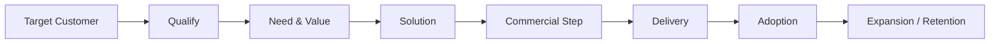
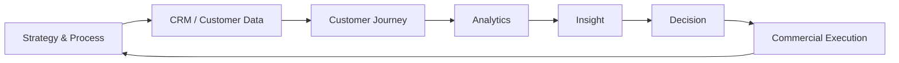

# SALES LEADERSHIP FOUNDATION
## Formal commercial qualification — strategy, accounts, leadership, digital sales and controlling

**Strategy · Organization · Sales Processes · Account Management · Negotiation · Leadership · CRM · Digital Sales · Analytics**

> This page summarizes the scope of my formal Sales Leader qualification and the commercial methods behind my work. It does not claim that training content itself is professional execution experience. Practical experience is described separately in the portfolio and CV.

---

## Why I include this

My commercial background is not based only on customer-facing experience. I also completed a structured Sales Leader qualification covering the full commercial operating system — from strategy and organization through account development, negotiation, people leadership, CRM and data-driven sales control.

The qualification consisted of **22 modules** plus a practical project in which I developed a complete sales strategy and sales concept for a new smart-energy technology product.

---

## The 22-module capability map

Rather than reproduce course material, I group the qualification into the capabilities that matter in practice.

### 1 · Sales strategy & market focus
Modules covered sales strategy, market and customer potential, competitive positioning, target groups, channel choices and the translation of company direction into commercial priorities.

**What this means in my work:**

- start with market and customer value, not activity volume
- select where to compete before scaling effort
- connect differentiation with a commercially relevant customer problem
- turn strategy into measurable objectives

### 2 · Sales organization & channels
The qualification covered organizational design, direct and indirect channels, partner structures, information flow, motivation through organization and sales planning.

**What this means in my work:**

- choose the operating model around customer and market needs
- define roles, decision rights and information flow clearly
- use direct, partner or hybrid motions deliberately
- avoid organizational complexity that does not create customer or commercial value

### 3 · Sales process & customer lifecycle
Several modules focused on structured sales processes: acquisition, qualification, needs analysis, solution presentation, offer and negotiation, implementation, customer development, retention, cross-selling, win-back and partner acquisition.

**What this means in my work:**

The sales process should be synchronized with the customer's buying and implementation process — not treated as an internal funnel only.

### 4 · Strategic accounts & customer conversations
Account strategy, relevant decision makers, buying-center thinking, structured customer conversations, needs analysis, value argumentation, presentations and customer-oriented service were covered in depth.

**What this means in my work:**

- understand the account before pushing the product
- identify the people who influence, use, approve and buy
- separate stated requirements from the underlying business need
- build trust through technical and commercial credibility
- make the next customer decision explicit

### 5 · Negotiation & commercial discipline
The qualification included negotiation preparation, interests versus positions, alternatives / BATNA, procurement situations and price negotiations.

**What this means in my work:**

- prepare objectives and limits before negotiating
- understand the other side's interests and constraints
- preserve value rather than defaulting to discounting
- use objective criteria where possible
- keep the relationship constructive while remaining clear on commercial boundaries

### 6 · Sales leadership, people & performance
The leadership modules covered goal setting, operating conditions, sales steering, support and development of salespeople, change management, recruiting, role profiles, motivation and self-organization.

**What this means in my work:**

- translate strategy into clear quantitative and qualitative goals
- recruit against capability needs, not generic job titles
- coach around real performance gaps
- create clarity, accountability and decision rights
- distinguish between a strong individual contributor and a strong people leader

### 7 · CRM, Digital Sales & data-driven steering
The final modules addressed integrated CRM, digital sales strategies, customer journeys, new technologies in sales and data / analytics for sales controlling.

The underlying principles are still highly relevant:

- **technology follows strategy and process**
- customer data should support a coherent account view, not create another silo
- digital and personal channels should reinforce each other
- analytics should improve decisions, prioritization and customer understanding
- sales controlling should connect information, planning, control and management action

---

## How this connects to Enterprise AI

The technologies have changed dramatically since the qualification. The management logic has not.

Enterprise AI creates a new layer of possibilities for customer interaction, analysis, automation and delivery — but the same questions still determine commercial success:

- Which market and customer problem deserves focus?
- Where is the measurable value?
- Who is involved in the decision?
- How does the solution fit the customer's operating environment?
- Can what is sold be implemented successfully?
- How do we measure adoption and business impact?
- What evidence justifies expansion?

That is why I combine **commercial leadership, technical understanding, customer delivery and AI** rather than treating them as separate disciplines.

---

## Practical proof

The formal qualification was completed with a practical project: an end-to-end sales strategy and sales concept for a smart-energy technology product, including market analysis, segmentation, competitive positioning, target-group definition, sales objectives, KPIs, communication and channels.

[Read the factual commercial strategy case →](../examples/commercial-strategy-smart-energy.md)

---

### Public boundary

This page deliberately summarizes capability areas only. Training materials, detailed commercial models, private company data, customer information, pricing, negotiation tactics and proprietary implementation details are not published.