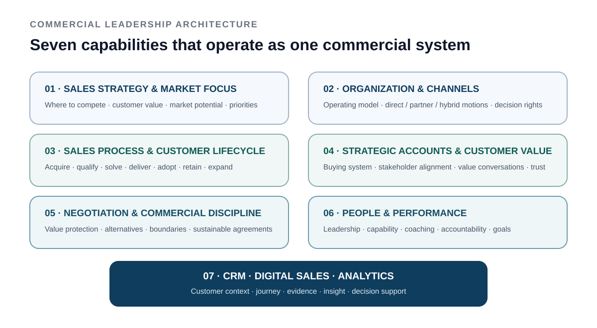

# SALES LEADERSHIP FOUNDATION

## Commercial leadership built on business management, customer responsibility and technology depth

**Strategy · Organization · Sales Process · Strategic Accounts · Negotiation · Leadership · CRM / Digital Sales / Analytics**

> This page summarizes the formal commercial leadership capabilities that complement my professional customer, technology and delivery experience. The qualification itself is evidence of structured commercial development; practical execution experience is described separately in the portfolio and CV.

---

## The commercial foundation behind the profile

My commercial development did not start with a sales certificate.

In **1998**, I completed the **Technischer Betriebswirt IHK / Certified Technical Business Economist**, a senior cross-functional business qualification at **Master level (DQR/EQF Level 7)**. It gave me an early foundation in business management, economics and the connection between technology and enterprise decision-making.

Over the following years, my responsibilities increasingly included customers, solutions, projects, programs, leadership and business development. In **2019**, I deliberately strengthened the commercial and change-leadership side of that experience with formal **Sales Leader / Vertriebsleiter** and **Change Manager** qualifications.

The result is not a transition from “technical” to “commercial.” It is the combination of both:

> **technology understanding + business management + customer leadership + commercial discipline + delivery credibility**

For complex B2B and Enterprise AI environments, that combination is particularly valuable because customer growth depends on more than selling. It depends on identifying the right market problem, creating a credible value proposition, aligning stakeholders, structuring the commercial case and delivering successfully.

---

## Seven Commercial Leadership Capabilities

Rather than reproduce course modules, I group the Sales Leader qualification into **seven capability areas that operate as one commercial system**.

  

### 1 · Sales strategy & market focus
The qualification covered sales strategy, market and customer potential, competitive positioning, target groups, channel choices and the translation of company direction into commercial priorities.

**What this means in my work:** start with market and customer value, select where to compete before scaling effort, connect differentiation with a commercially relevant customer problem and turn strategy into measurable objectives.

### 2 · Sales organization & channels
The qualification covered organizational design, direct and indirect channels, partner structures, information flow, motivation through organization and sales planning.

**What this means in my work:** choose the operating model around customer and market needs, define roles and decision rights clearly, use direct / partner / hybrid motions deliberately and avoid complexity that does not create commercial value.

### 3 · Sales process & customer lifecycle
The qualification covered the end-to-end commercial process: acquisition, qualification, needs analysis, solution presentation, offer and negotiation, implementation, customer development, retention, cross-selling, win-back and partner acquisition.

The sales process should be synchronized with the customer's buying and implementation process — not treated as an internal funnel only.

### 4 · Strategic accounts & customer conversations
Account strategy, decision makers, buying-center thinking, structured customer conversations, needs analysis, value argumentation, presentations and customer-oriented service were covered in depth.

**What this means in my work:** understand the account before pushing the product, identify the people who influence / use / approve / buy, separate stated requirements from the underlying business need, build trust through technical and commercial credibility and make the next customer decision explicit.

### 5 · Negotiation & commercial discipline
The qualification included negotiation preparation, interests versus positions, alternatives / BATNA, procurement situations and price negotiations.

**What this means in my work:** prepare objectives and boundaries, understand the other side's constraints, preserve value rather than default to discounting, use objective criteria where possible and keep the relationship constructive without losing commercial discipline.

### 6 · Sales leadership, people & performance
The leadership content covered goal setting, operating conditions, sales steering, development of salespeople, change, recruiting, role profiles, motivation and self-organization.

**What this means in my work:** translate strategy into clear goals, recruit and develop against capability needs, coach around real performance gaps, create accountability and connect individual performance with team and business outcomes.

### 7 · CRM, Digital Sales & data-driven steering
The qualification also covered integrated CRM, digital sales strategies, customer journeys, new technologies in sales and data / analytics for sales controlling.

The principles remain highly relevant:

- **technology follows strategy and process**
- customer data should create a coherent account view, not another silo
- digital and personal channels should reinforce each other
- analytics should improve decisions, prioritization and customer understanding
- sales controlling should connect information, planning, control and management action

---

## Why this matters for Enterprise AI and technology leadership

The technologies have changed dramatically. The management questions have not.

Enterprise AI creates new possibilities for customer interaction, analysis, automation and delivery — but commercial success still depends on selecting the right market and customer problem, making value measurable, understanding the stakeholder and buying system, connecting the solution with the customer's operating environment, ensuring that what is sold can actually be delivered and adopted, and measuring impact strongly enough to justify expansion.

That is why I combine **commercial leadership, business management, technical understanding, Agile / hybrid delivery and Enterprise AI** rather than treating them as separate disciplines.

---

## Practical proof

The Sales Leader qualification included a practical project in which I developed an end-to-end **sales strategy and sales concept for a smart-energy technology product**, covering market analysis, segmentation, competitive positioning, target-group definition, sales objectives, KPIs, communication and channels.

[Read the factual commercial strategy case →](../examples/commercial-strategy-smart-energy.md)

---

### Public boundary

This page deliberately summarizes capability areas only. Training materials, detailed commercial models, private company data, customer information, pricing, negotiation tactics and proprietary implementation details are not published.

<!-- acronym-legend:start -->
> **Terminology on this page**  
> **AI** — Artificial Intelligence · **CRM** — Customer Relationship Management · **KPI** — Key Performance Indicator
<!-- acronym-legend:end -->
