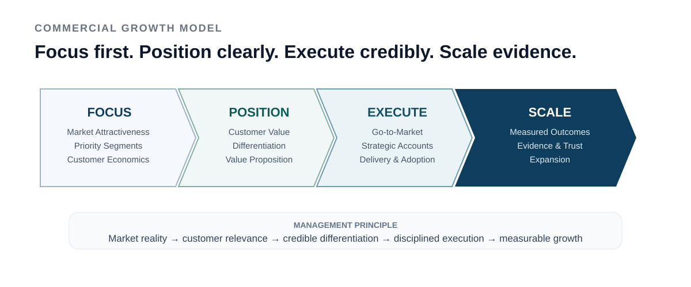

# SELECTED BUSINESS, COMMERCIAL & LEADERSHIP QUALIFICATIONS

## Formal qualifications supporting commercial, general-management and transformation responsibilities

**Business Management · Sales Leadership · Online Marketing · Customer Value · ERP Sales Processes · Change · Operational Excellence**

> This page summarizes selected formal qualifications that are most relevant to my current positioning. It deliberately does not list every course or certificate I have completed.

---

## Commercial and business core

| Qualification | Relevance |
|---|---|
| **Certified Technical Business Economist (IHK), Master level (DQR/EQF Level 7)** | Business management, economics and cross-functional enterprise perspective |
| **Certified Sales Leader / Vertriebsleiter** | Sales strategy, strategic accounts, leadership, customer and sales analytics, CRM, digital sales and sales controlling |
| **Online Marketing Manager qualification** | Digital marketing strategy, customer journey, search, email, social media, content, campaigns and web analytics |
| **SAP Sales / Sales Order Processing** | SAP Key User Sales with SAP ERP 6.0 plus SAP User Certification in Sales Order Processing |

The combination matters more than the individual certificates. It connects **market understanding, customer acquisition and development, commercial steering, digital channels, enterprise processes and business economics**.

---

## Online Marketing Manager

The Online Marketing Manager qualification covered both multimedia / web foundations and online marketing.

Relevant commercial topics included:

- online marketing strategy and planning
- customer journey thinking
- search engine optimization and search advertising
- email marketing
- social media marketing
- content marketing
- campaign planning and execution
- web analytics / Google Analytics
- website and content-management foundations
- digital customer acquisition and conversion logic

This complements the Sales Leader background by adding the **digital demand, channel and customer-journey perspective** to strategic account development and enterprise selling.

---

## Leadership, change and operational excellence

Selected additional qualifications include:

- **Change Manager**
- **Six Sigma Black Belt**
- **Lean Manager**
- **Lean Six Sigma Project Specialist**
- **Lean / Six Sigma Trainer**
- **Train the Trainer**
- **Moderation / Presentation**
- **Professional Scrum Master II**
- **Professional Scrum Product Owner I**
- **PRINCE2 Agile**
- **PRINCE2 Foundation in Project Management**

These support the execution side of commercial and transformation mandates: aligning people, improving processes, facilitating decisions and turning strategy into an operating system.

---

## Why this matters for technology and AI businesses

For complex B2B technology, I do not separate commercial leadership from delivery reality.

  

The qualifications above reinforce the same principle that runs through my professional experience:

> **Understand the market. Create customer relevance. Build the commercial case. Know how the enterprise actually works. Deliver what was promised. Use the result to grow the relationship.**

---

### Public boundary

Only qualification titles and high-level capability areas are summarized here. Original certificates, certificate numbers and detailed course material are not published in this repository.

<!-- acronym-legend:start -->
> **Terminology on this page**  
> **AI** — Artificial Intelligence · **CRM** — Customer Relationship Management · **ERP** — Enterprise Resource Planning
<!-- acronym-legend:end -->
