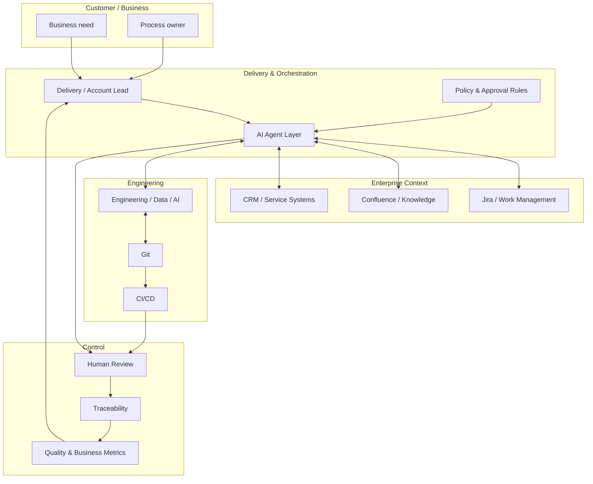
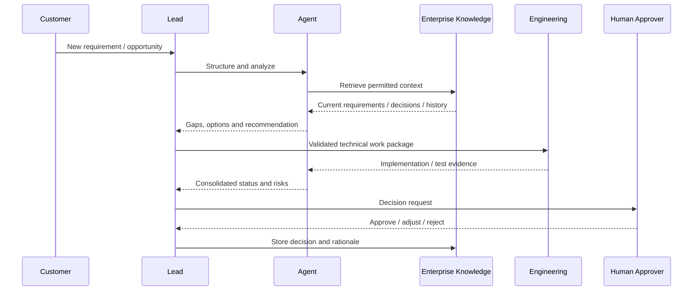

# Agentic Delivery Architecture

## Human + AI + Engineering as one delivery system

Agentic delivery works best when agents are treated as **orchestration and augmentation components**, not as unaccountable replacements for people.

## Why this matters

Traditional delivery often separates:

- customer conversations
- project tracking
- knowledge
- engineering
- commercial decisions
- governance

An agentic architecture can reduce that fragmentation — **without removing accountability**.

## Responsibilities by layer

### 1. Business / Customer layer
Defines why the work exists.

- business outcome
- process context
- stakeholder priorities
- acceptance criteria

### 2. Agent layer
Accelerates information work and orchestration.

Possible tasks:
- summarize approved context
- identify missing requirements
- draft work items
- detect dependencies
- prepare status / decision material
- classify risks
- route work to the appropriate team
- suggest next-best actions

### 3. System-of-record layer
Keeps authoritative information in enterprise systems.

Examples:
- Jira for work and decisions
- Confluence for knowledge and operating context
- CRM / ITSM / ERP for business transactions
- Git for source-controlled technical artifacts

### 4. Engineering layer
Builds, validates and operates the technical solution.

- application engineering
- data / ML / AI engineering
- integration
- testing
- CI/CD
- observability

### 5. Human control layer
Retains explicit decision authority where it matters.

Examples:
- commercial commitment
- customer-facing promise
- production release
- high-risk recommendation
- policy exception
- sensitive data access

---

# Autonomy model

Not every agent deserves the same autonomy.

| Level | Agent behavior | Human role |
|---|---|---|
| **L0** | retrieve / summarize | user decides everything |
| **L1** | recommend | human approves action |
| **L2** | prepare and execute low-risk tasks | human reviews exceptions |
| **L3** | autonomous within explicit policy boundaries | human governs policy and audits |

The correct level depends on risk, reversibility, customer impact and regulatory context.

---

# Example delivery loop

---

# Cost-aware architecture

Agentic does **not** have to mean uncontrolled API spend.

A cost-aware design can use:

- the smallest capable model for each task
- retrieval instead of repeatedly sending large contexts
- deterministic automation where AI is unnecessary
- caching / reuse of stable outputs
- event-driven agent execution instead of constant polling
- local or controlled inference where data sensitivity or economics require it

The operating question is:

> **Where does intelligence create enough incremental value to justify its cost and risk?**

---

## Architecture principle

**Use AI to compress coordination effort, not to blur accountability.**
