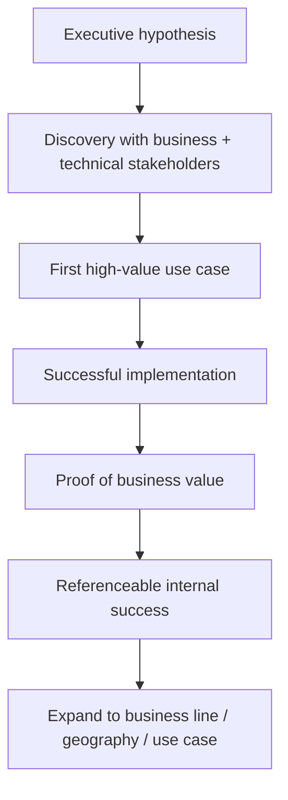

# Commercial Value Framework for Enterprise AI

## From interesting technology to strategic account growth

AI opportunities become commercially meaningful when three things are true at the same time:

- the customer problem is important enough
- the solution is implementable and adoptable
- the value can be measured and expanded

## Opportunity qualification

A simple five-dimension scorecard:

| Dimension | Question | Score |
|---|---|---|
| Strategic relevance | Does this matter to the customer's priorities? | 1–5 |
| Economic value | Is there credible upside or cost reduction? | 1–5 |
| Technical feasibility | Can the solution be integrated reliably? | 1–5 |
| Adoption feasibility | Will users and process owners adopt it? | 1–5 |
| Expansion potential | Can success open additional use cases or business lines? | 1–5 |

A high AI novelty score is deliberately **not** included.

## Value model

A practical business case can combine:

**Annual Value = Revenue Uplift + Avoided Cost + Productivity Gain + Risk Reduction – Run Cost**

Not every component needs to be monetized with false precision. What matters is a transparent logic that the customer can challenge and validate.

## Strategic account motion

### What creates trust

- technically credible promises
- clear commercial logic
- realistic delivery commitments
- transparent risk management
- evidence after go-live

## Account leadership metrics

| Area | Example metric |
|---|---|
| Pipeline | qualified strategic opportunities |
| Conversion | opportunity-to-pilot / opportunity-to-contract |
| Delivery | time to first value |
| Adoption | active usage / completion rate |
| Outcome | customer KPI improvement |
| Growth | expansion pipeline / follow-up business |
| Relationship | executive sponsorship / referenceability |

## Why technical delivery matters commercially

In enterprise AI, the sale is only the beginning. Poor implementation destroys future revenue; successful implementation can create a platform for expansion.

That is why I treat **account development and customer delivery as one connected leadership responsibility** rather than two independent functions.

---

## Commercial principle

**Sell what can be delivered. Deliver what creates value. Use evidence to earn the right to expand.**
