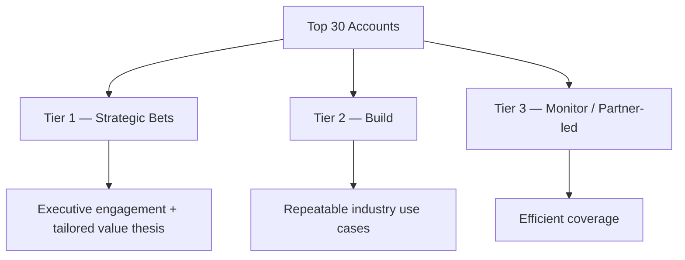
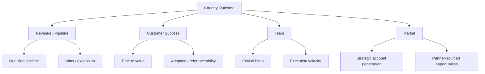

# Country Market Build Playbook — Enterprise AI

## A reference model for launching and scaling an AI business in-country

This is a leadership framework for building a country motion that connects **strategic accounts, enterprise implementation, partners, brand and team formation**.

It is not a company-specific plan and does not contain confidential information.

---

# 0–90 day build logic

## 0–30 days — Understand

### Market
- segment the German enterprise landscape
- identify industries with strongest product / AI fit
- understand regulatory and adoption friction
- map relevant local competitors and alternatives

### Accounts
- define a **Top-30 strategic account universe**
- map executive sponsors, technical buyers and process owners
- identify existing relationships and partner entry points

### Delivery
- understand implementation dependencies
- define what can be standardized vs. tailored
- identify common integration patterns

### Team
- clarify founding-team capabilities
- define role boundaries across sales, solutions and implementation

### Output
- country hypothesis
- account tiering
- baseline pipeline
- first partner map
- hiring priorities

---

## 31–60 days — Focus

### Top-account model

For each Tier-1 account:

- executive value hypothesis
- technical adoption hypothesis
- stakeholder map
- entry use case
- commercial path
- implementation requirements
- expansion logic

### Pipeline quality
A pipeline is not a list of names. Each opportunity should have:

- identifiable business pain
- budget / economic logic
- executive or process ownership
- credible next action
- technical feasibility
- expected time to value

### Partners
Classify potential partners by value:

| Partner type | Value |
|---|---|
| Technology | integrations, infrastructure, complementary capability |
| Consulting / SI | enterprise access, implementation scale |
| Channel | market reach |
| Industry ecosystem | credibility, domain access |

---

## 61–90 days — Execute

### Commercial rhythm
- weekly strategic-account review
- pipeline quality over vanity volume
- explicit ownership of next actions
- customer-delivery feedback into sales qualification

### Delivery rhythm
- time-to-first-value metric
- visible implementation risks
- reusable integration patterns
- executive escalation only where decisions are required

### Market presence
Invest in events and media where they create one of three outcomes:

1. access to strategic accounts
2. category credibility
3. partner leverage

Avoid activity that creates visibility without commercial relevance.

### Hiring
Build around the bottleneck, not around org-chart convention.

Potential early roles:
- strategic enterprise sales
- solution / technical consulting
- implementation / customer delivery
- partner development

---

# Country KPI tree

## Example executive dashboard

| Area | Leading indicator | Outcome indicator |
|---|---|---|
| Strategic accounts | executive meetings, validated use cases | contracts / expansions |
| Pipeline | qualified opportunities | revenue / ARR / bookings |
| Delivery | implementation readiness | time to value / adoption |
| Partners | activated strategic partners | partner-sourced pipeline |
| Brand | relevant event / media reach | inbound strategic opportunities |
| Team | time to hire | productivity / target attainment |

---

# Leadership principle

A strong country GM should be able to move between:

**market strategy → executive customer conversation → commercial decision → technical implementation → team leadership → measurable result**

without treating any of those as somebody else’s problem.
