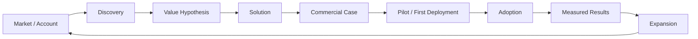
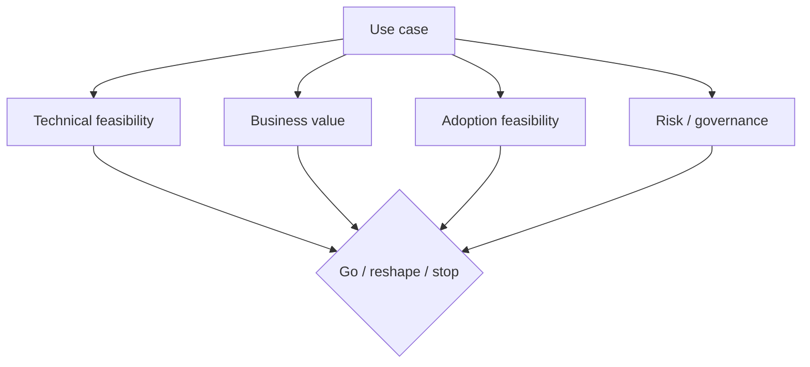
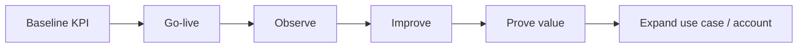

# Enterprise AI Operating Model

## Purpose

A practical operating model for moving from a strategic customer opportunity to repeatable enterprise value.

The premise is simple: **AI delivery is not a hand-off from Sales to Technology. It is one connected value stream.**

## 1. Market & account

### Questions
- Which enterprise accounts have both a meaningful problem and the ability to scale a solution?
- Which business lines have measurable pain, high interaction volume or strong automation potential?
- Who owns the outcome commercially and operationally?

### Output
- account hypothesis
- stakeholder map
- opportunity thesis
- initial value indicators

## 2. Discovery

Discovery should capture more than requirements.

| Area | Questions |
|---|---|
| Business | What outcome must improve? |
| Customer | Who experiences the problem? |
| Process | Where is friction, delay or waste? |
| Data | What context is available and permissible? |
| Technology | What must integrate? |
| Risk | What must never be delegated blindly? |
| Commercial | Is there a credible value and expansion path? |

## 3. Value hypothesis

A strong AI use case can usually be stated as:

> **For [user/process], use AI to improve [measurable outcome] by [mechanism], while preserving [critical control].**

Examples of measurable outcomes:
- conversion
- resolution rate
- cycle time
- cost per interaction
- quality / defect reduction
- employee productivity
- customer satisfaction
- revenue retention / expansion

## 4. Solution & commercial case

Technology and commercial logic should converge before delivery begins.

A useful decision does not ask only **“Can we build it?”** but also:

- Is it worth building?
- Can the customer adopt it?
- Can it be governed?
- Can it scale?
- Can success create a larger strategic relationship?

## 5. Governed delivery

Delivery should make ownership visible.

| Workstream | Accountable outcome |
|---|---|
| Customer / Account Lead | value, relationship, commercial alignment |
| Delivery Lead | scope, timing, dependencies, decisions |
| AI / Data / Engineering | technical implementation and quality |
| Security / Governance | guardrails and control model |
| Customer Process Owner | adoption and operational integration |

## 6. Adoption

A technically correct solution with poor adoption is not successful delivery.

Adoption design includes:
- workflow integration
- user trust
- escalation paths
- training / enablement
- measurable acceptance criteria
- operational ownership

## 7. Measure & expand

Expansion should be evidence-led, not assumption-led.

### Executive scorecard

| KPI family | Example |
|---|---|
| Business | revenue, savings, cycle time |
| Customer | CSAT, resolution, conversion |
| AI quality | accuracy, task success, escalation rate |
| Operations | latency, availability, cost per transaction |
| Adoption | active use, acceptance, repeat usage |
| Commercial | pipeline created, expansion value, renewal |

---

## Leadership principle

**The best enterprise AI leaders can move between the boardroom, the customer process, the engineering conversation and the commercial decision without losing the thread of value.**
