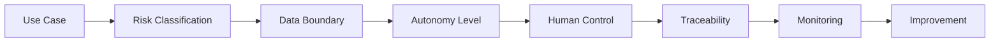

# AI Governance & Risk

## Governance that enables delivery

Good AI governance should not become a parallel bureaucracy. It should make it easier to answer four questions:

1. **What is the agent / model allowed to do?**
2. **What data is it allowed to use?**
3. **Where must a human decide?**
4. **How can we reconstruct what happened?**

## Risk dimensions

| Dimension | Example questions |
|---|---|
| Customer impact | Could an incorrect output materially harm the customer relationship? |
| Financial impact | Can the AI trigger commitments, discounts or transactions? |
| Data sensitivity | Does the workflow use personal, confidential or regulated information? |
| Reversibility | Can a wrong action be easily undone? |
| Explainability | Must the decision rationale be shown to a user or auditor? |
| Operational dependency | What happens when the model or integration is unavailable? |

## Simple control matrix

| Risk | AI autonomy | Human control |
|---|---|---|
| Low | execute within defined workflow | periodic review |
| Medium | prepare / recommend | approval before consequential action |
| High | retrieve / analyze only | human makes the decision |

## Core guardrails

### Data boundaries
- use only approved enterprise context
- apply least-privilege access
- avoid unnecessary context transfer
- keep authoritative records in systems of record

### Human-in-the-loop
Human approval is especially valuable for:
- production release
- customer commitments
- exceptions to policy
- high-value commercial decisions
- sensitive external communication

### Traceability
A governed AI workflow should capture where appropriate:
- triggering event
- source context
- agent / model action
- recommendation or output
- human decision
- resulting system change

### Monitoring
Measure more than model accuracy:
- task success
- escalation rate
- latency
- cost per completed task
- override rate
- customer / user outcome

---

## Governance principle

**The objective is not to remove risk. It is to make autonomy proportional to risk and accountability visible.**
