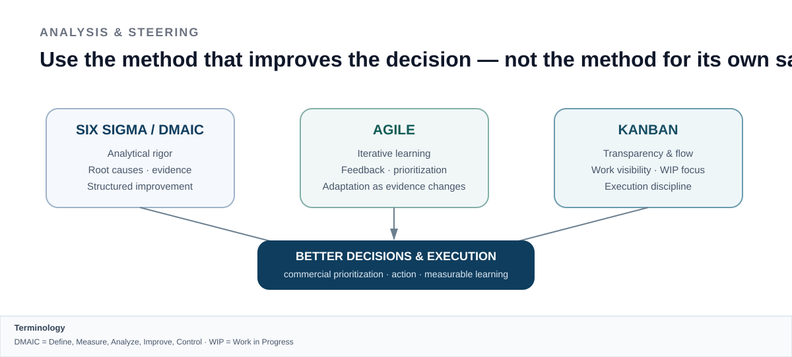

# COMMERCIAL STRATEGY CASE

## Sales strategy & go-to-market for smart-energy technology

**Market Analysis · Customer Segmentation · Competitive Positioning · Sales Strategy · KPIs · Channels**

> **Factual project summary.** This work was completed as part of my Sales Leader qualification. Company-confidential data, detailed forecasts, pricing, business-plan figures and proprietary implementation details are intentionally not published here.

---

## The assignment

I developed an end-to-end **sales strategy and sales concept for a new smart-energy technology product**.

The work was not limited to promotion or sales activity. It connected the company context, product, market and customer economics with a structured commercial approach.

  

---

## Scope of work

The project covered:

- company and process context
- company vision and a dedicated sales vision
- analysis of the current market situation
- product and value proposition / USP analysis
- market-potential assessment
- competitor analysis
- SWOT analysis
- structured improvement and decision logic using **Six Sigma / DMAIC**
- **Agile principles for iterative learning, prioritization and adapting actions as evidence changed**
- **Kanban principles for visualizing work, flow, priorities and execution focus**
- assessment of sales potential
- segmentation of relevant smart-energy markets
- analysis of customer buying motives and economic expectations
- definition of the core target group
- strengths / weaknesses comparison against key competitors
- derivation of marketing and sales objectives from company strategy
- planned commercial KPIs and forecast logic
- communication strategy
- sales channels to the customer

The methodological approach was deliberately **not limited to one framework**. Analytical rigor, iterative learning and execution flow were combined according to the decision or problem at hand.

---

## My commercial logic

My commercial logic starts with **market reality and customer value — not with sales activity**. The objective is to focus on the segments where the company can create relevant value, differentiate credibly and build a measurable route to market.

> **Focus first. Position clearly. Execute credibly. Scale evidence.**

This required connecting technical product understanding with commercial questions:

- What problem does the product solve?
- Which market segments are attractive enough to pursue?
- What motivates customers economically and operationally?
- How does the offer compare with the main alternatives?
- Where is the strongest differentiation?
- Which customer groups should receive priority?
- Through which channels should they be reached?
- Which objectives and KPIs show whether the strategy is working?

---

## Customer and market orientation

A major part of the project was **segmentation and prioritization** rather than treating the market as one homogeneous opportunity.

The analysis included distinct smart-energy segments, buying motives, market potential and a defined core target group. Commercial objectives were then derived from the broader company objectives and strategy.

> **Do not pursue every possible customer. Understand where value, fit, buying motivation and execution capability come together — then focus.**

---

## Competitive and strategic analysis

The work combined market information with complementary analysis and steering approaches:

- competitor comparison
- SWOT
- strengths / weaknesses analysis
- **Six Sigma / DMAIC** for structured problem analysis and improvement
- **Agile** for iterative learning, feedback and adaptation
- **Kanban** for transparency, prioritization, flow and execution focus

  

The purpose was not methodology for its own sake. Different methods were used to improve **decision quality, commercial prioritization and execution**, depending on the problem being addressed.

---

## KPI-based sales steering

The project included planned KPIs and forecast logic as part of the commercial concept.

> **KPIs should create transparency and support decisions. They show where performance is moving; leadership still has to understand why and decide what to change.**

I prefer a small set of meaningful indicators connected to business outcomes rather than a large dashboard with little decision value. Typical dimensions include revenue / order development, customer and segment performance, conversion and opportunity quality, market penetration, sales-channel contribution and customer value / retention potential.

---

## Sales leadership perspective

The broader Sales Leader qualification also covered the areas required to lead a commercial organization, including leadership and motivation of a sales team, sales and customer analytics, marketing strategy and market-oriented sales policy, KPI-based sales steering, cost and performance accounting, personnel selection and employment-law fundamentals.

Combined with my professional customer, Key Account, Business Development and technical leadership experience, this gives me a commercial perspective that is **both strategic and execution-oriented**.

---

## What this case demonstrates

This project demonstrates my ability to connect:

**technology → market → customer value → competitive position → commercial strategy → measurable execution**

It also reflects a broader leadership principle in my work: **use the method that best fits the decision — structured analysis where rigor is needed, Agile where learning and adaptation matter, and Kanban where transparency and flow improve execution.**

That combination is especially relevant when a technically sophisticated product has to be translated into a credible enterprise value proposition and a scalable market approach.

---

### Public boundary

The public version intentionally excludes company-confidential data, detailed revenue forecasts, product pricing, customer-specific information, business-plan figures and proprietary sales tactics.

<!-- acronym-legend:start -->
> **Terminology on this page**  
> **DMAIC** — Define, Measure, Analyze, Improve, Control · **KPI** — Key Performance Indicator
<!-- acronym-legend:end -->
