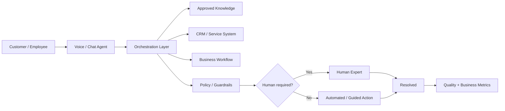
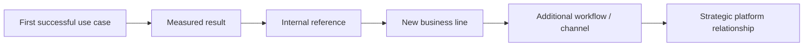

# Worked Example — Enterprise Conversational AI

> Public reference example using fictionalized assumptions. No customer or confidential project data.

## Scenario

A large enterprise receives a high volume of repetitive customer and employee service interactions. Response times vary, knowledge is fragmented across multiple systems, and specialists spend significant time on routine questions.

## Objective

Create a conversational AI capability that can:

- answer recurring questions using approved enterprise knowledge
- retrieve context from existing systems
- guide users through defined workflows
- escalate appropriately to a human
- measure quality and business value

## 1. Value hypothesis

> **Use conversational AI to reduce routine handling effort and improve response speed while keeping sensitive or consequential decisions under human control.**

Potential measures:

- containment / resolution rate
- average handling time
- time to first response
- escalation rate
- customer satisfaction
- specialist hours released
- cost per resolved interaction

## 2. Reference architecture

## 3. Delivery plan

### Phase A — Discover
- identify top interaction categories
- map business owners and systems
- define baseline KPIs
- identify high-risk actions

### Phase B — Prove
- select a narrow, measurable use case
- integrate approved knowledge
- create human escalation
- test quality and failure modes

### Phase C — Operate
- add monitoring
- measure cost, task success and escalation
- establish operational ownership
- improve prompts, retrieval and workflow rules

### Phase D — Expand
- add adjacent use cases
- extend to new business lines or channels
- reuse integrations and governance patterns

## 4. Human-control model

| Action | Suggested autonomy |
|---|---|
| Answer from approved FAQ / knowledge | AI may answer directly |
| Draft customer response | AI drafts, human optionally reviews based on risk |
| Change commercial terms | human approval required |
| Sensitive personal-data decision | human decision required |
| Routine workflow step with clear rule | AI may execute within policy |

## 5. Commercial expansion logic

The first implementation is therefore both a delivery milestone and a strategic-account opportunity.

## Key lesson

**The differentiator is not the conversation alone. It is the combination of model quality, enterprise integration, governance, adoption and commercial value.**
