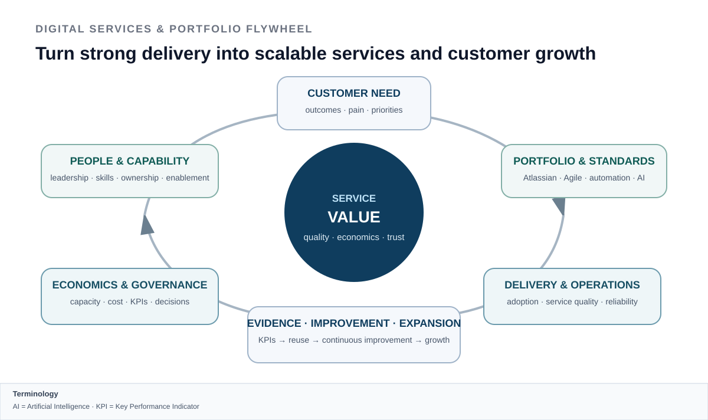
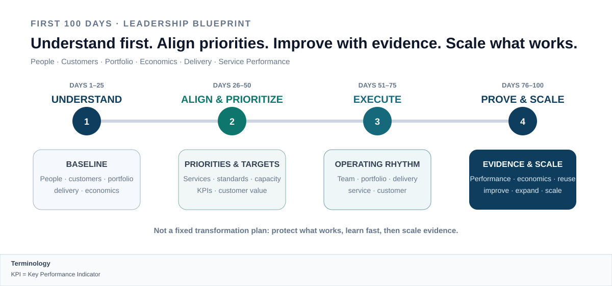

# ILLUSTRATIVE LEADERSHIP EXAMPLE

## First 100 Days — Digital Services & Portfolio Leadership

**People · Customers · Portfolio · Economics · Atlassian · Agile · Automation · AI · Service Performance · Growth**

> **This is an illustrative leadership blueprint. It shows how I would structure the first 100 days of a technical consulting and digital-services leadership mandate after understanding the existing organization, customers and commitments.**

---

## Leadership premise

The first 100 days are not a fixed transformation plan. They are a structured way to **understand the existing business, protect what already works, identify the highest-value priorities and build evidence before scaling change**.

The operating model has to connect six perspectives from the beginning:

**People · Customers · Portfolio · Economics · Delivery · Service Performance**

  

The objective is not maximum change. It is a **focused, evidence-based leadership rhythm** that improves customer value, delivery reliability, service quality and economic performance while creating room for scalable portfolio growth.

---

# First 100 Days Leadership Blueprint

  

The plan answers four progressively harder questions:

1. **What is already working, and where are the real constraints?**
2. **Which priorities create the highest customer and business value?**
3. **Can improvements be executed without destabilizing delivery and service?**
4. **What is strong enough to standardize, reuse and scale?**

---

## Days 1–25 · UNDERSTAND
### Build the baseline before changing the system

I would first establish a fact base across:

- **People & capability** — roles, leadership capacity, skills, development needs, ownership and critical dependencies,
- **Customers** — strategic relationships, current commitments, service expectations, pain points and expansion potential,
- **Portfolio** — current offerings, Atlassian / Agile / digitalization capabilities, maturity, differentiation and demand,
- **Economics** — budgets, forecast logic, utilization, capacity, cost-to-serve and relevant performance drivers,
- **Delivery & service** — quality, reliability, escalations, dependencies, adoption, operating issues and recurring friction,
- **Governance** — KPIs, reporting, standards, decision rights and escalation paths.

I would also identify what must be protected because it already creates customer value or delivery stability.

**Day-25 output:**

> **A shared baseline: strengths to preserve, constraints to address, customer priorities, capability gaps, economic drivers and the first evidence-based leadership hypotheses.**

---

## Days 26–50 · ALIGN & PRIORITIZE
### Turn the baseline into explicit choices

The next step is to align priorities with leadership, customers and the team.

I would focus on:

- a small set of **customer and portfolio priorities**,
- clear **service and delivery outcomes**,
- capacity and resource choices,
- standards that create scale without unnecessary bureaucracy,
- a focused KPI set covering quality, economics, delivery and customer value,
- a portfolio view across **Atlassian, Agile / Hybrid, workflow digitalization, automation and AI-enabled services**,
- opportunities where Rovo, automation or agents can improve measurable work or service outcomes.

The goal is not to create a long roadmap. It is to make the most important choices visible and executable.

**Day-50 output:**

> **A focused leadership agenda: priorities, target outcomes, ownership, capacity choices, KPIs and a clear view of which portfolio and service improvements deserve attention first.**

---

## Days 51–75 · EXECUTE
### Establish a reliable operating rhythm

This phase turns priorities into working management routines and selected improvements.

I would establish:

- a transparent cadence for **people, portfolio, customers, delivery and economics**,
- management visibility on capacity, risks, KPIs, costs and corrective actions,
- focused Atlassian / Agile improvements where they remove real delivery friction,
- selected workflow automation or AI-enabled use cases with clear human review and governance,
- stronger adoption, enablement and service ownership,
- feedback loops between customer experience, delivery performance and portfolio decisions.

The principle is to improve the system without creating operational micromanagement.

**Day-75 output:**

> **A functioning leadership and service rhythm with visible priorities, measurable improvements, clear ownership and a direct connection between customer value, delivery performance and economic steering.**

---

## Days 76–100 · PROVE & SCALE
### Use evidence to decide what deserves more investment

By this stage I would expect enough evidence to distinguish local improvements from repeatable service patterns.

I would evaluate:

- **Customer value** — are customers experiencing better outcomes or stronger confidence?
- **Service quality** — are reliability, adoption, responsiveness or performance improving?
- **Economics** — are capacity, cost-to-serve, utilization and forecast drivers more transparent and steerable?
- **Delivery** — are risks, dependencies and escalations better controlled?
- **People** — are ownership, capability and accountability stronger?
- **Portfolio** — which Atlassian, Agile, automation or AI-enabled patterns can become reusable offers or standards?
- **Growth** — where does strong delivery justify follow-up business, additional services or broader customer adoption?

**Day-100 output:**

> **An evidence-based operating model: what to protect, what to improve, what to standardize, what to scale and where further investment creates the strongest customer and business value.**

---

# Managed-Service & Lifecycle Lens

A technical service portfolio should not stop at implementation.

> **Design → Deliver → Operate → Improve → Scale**

For every major offering or platform decision I would test five management dimensions:

| Dimension | Leadership question |
|---|---|
| **Customer Value** | Does the service solve a durable problem and create measurable outcomes? |
| **Service Quality** | Can it be operated and improved reliably? |
| **Economics** | Are capacity, cost-to-serve, tooling and margin transparent enough to steer? |
| **Governance** | Are ownership, controls, KPIs, risks and escalation paths clear? |
| **Scalability** | Can standards, skills and delivery assets be reused across teams and customers? |

This is particularly important for **Atlassian-centered services**: Jira, JSM, Confluence, Agile operating models, Rovo, automation and AI should connect to adoption, service performance, continuous improvement and customer expansion rather than remain isolated implementation topics.

---

# What I would personally own

| Area | Leadership focus |
|---|---|
| **People** | clarity, development, accountability, capacity and capability building |
| **Customers** | executive trust, customer outcomes, escalations and expansion opportunities |
| **Portfolio** | priorities, differentiation, standards and development of scalable services |
| **Economics** | budget, forecast, capacity, cost awareness, KPIs and corrective action |
| **Atlassian & Agile** | connect platform capability with operating models, governance and delivery outcomes |
| **Automation & AI** | use Rovo, agents and automation where they create measurable value with governance |
| **Service Performance** | connect delivery, operations, adoption, reliability and continuous improvement |
| **Growth** | convert strong delivery and reusable patterns into additional customer value and follow-up business |

---

## Leadership principle

> ### **Understand before changing. Protect what works. Prioritize where customer and business value intersect. Improve with evidence. Standardize what proves repeatable. Scale only what can be operated reliably and economically.**

<!-- acronym-legend:start -->
> **Terminology on this page**  
> **AI** — Artificial Intelligence · **JSM** — Jira Service Management · **KPI** — Key Performance Indicator
<!-- acronym-legend:end -->
