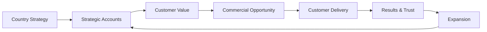
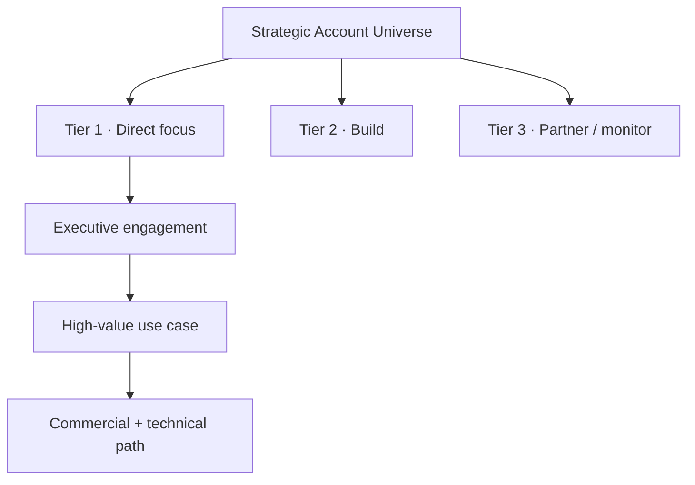

# ILLUSTRATIVE EXAMPLE
## How I would approach building an Enterprise AI country business

**Strategy · Strategic Accounts · Team · Delivery · Partners · Execution**

> **This is an illustrative leadership example. It shows how I would structure such a mandate; it is not presented as a country-GM project I have already executed.**

---

## Starting point

For me, a country mandate is not a sales plan on one side and an implementation organization on the other. The two have to reinforce each other.

The first objective would be to establish a **small number of clear priorities**, rather than create activity everywhere at once.

---

# First 90 days

## 0–30 days · Understand

I would first build a fact base around four questions:

### Market
- Where is the strongest product / market fit?
- Which industries and use cases have both urgency and realistic adoption potential?
- Which market-specific constraints matter in Germany?

### Strategic accounts
- Which accounts are strategically important?
- Where is there an identifiable business problem, executive sponsor and realistic path to value?
- Which customer relationships can benefit from technical credibility as well as commercial leadership?

### Delivery
- What does successful implementation actually require?
- Which parts can be repeatable and which need customer-specific work?
- Where are the typical dependencies between sales promise and technical delivery?

### Team
- Which capabilities are needed first across sales, solutioning and implementation?
- Where is the current bottleneck?

**Expected output:** a focused country hypothesis, prioritized account landscape, delivery assumptions and initial team priorities.

---

## 31–60 days · Focus

I would then narrow the market into a manageable strategic-account motion.

For priority accounts I would want clarity on:

- business problem and urgency
- decision makers and technical stakeholders
- value hypothesis
- implementation feasibility
- commercial path
- next concrete customer action
- expansion potential if the first use case succeeds

A large pipeline would not impress me if the opportunities are not real. I would rather have fewer accounts with **clear ownership, real customer pain and an executable next step**.

---

## 61–90 days · Execute

At this stage the operating rhythm matters more than presentations.

### Commercial rhythm
- regular strategic-account reviews
- explicit next actions and ownership
- technical feasibility included early in qualification
- feedback from delivery flowing back into sales

### Delivery rhythm
- visible implementation risks
- clear customer and internal ownership
- short path to first usable value
- avoid commitments that delivery cannot support

### Team
I would hire around the actual constraint, not around an idealized organization chart. Depending on need, that may mean strengthening:

- strategic enterprise sales
- technical solution capability
- implementation / customer delivery
- partner development

### Partners and market presence
I would prioritize partnerships, events and external visibility only where they help to create at least one of these outcomes:

1. access to relevant enterprise accounts
2. stronger market credibility
3. faster or better customer delivery

---

# How I would measure progress

I would keep the executive view deliberately compact.

| Dimension | Examples of signals |
|---|---|
| **Strategic Accounts** | quality of executive engagement, validated use cases, next-step discipline |
| **Commercial** | qualified opportunities, conversion, new and expansion business |
| **Delivery** | implementation readiness, time to first usable value, customer acceptance |
| **Team** | critical capability gaps, hiring progress, execution capacity |
| **Partners** | relevant activated partners, partner-created opportunities |
| **Market** | strategic account penetration and relevant market visibility |

---

## Leadership principle

> **The country leader should be able to move from market strategy to the customer conversation, from the commercial decision to technical delivery, and from delivery back to account growth without losing ownership of the overall result.**

---

### Public boundary

This example intentionally stays at leadership and operating-model level. It does not publish detailed account strategies, sales playbooks, implementation architecture, pricing logic or proprietary execution methods.
