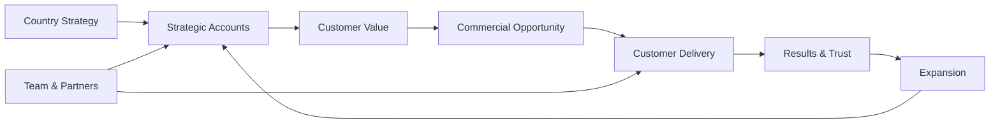
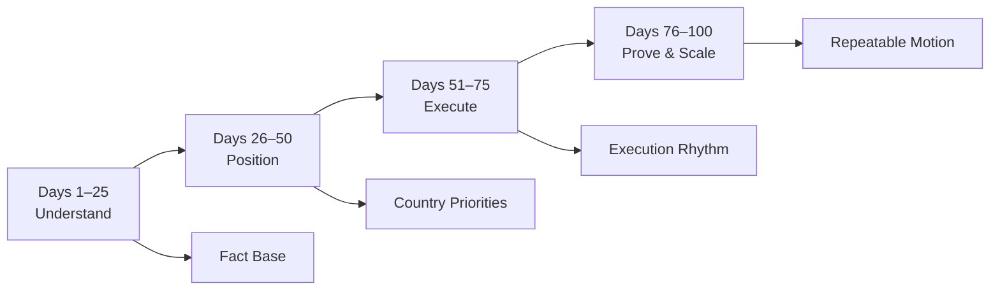
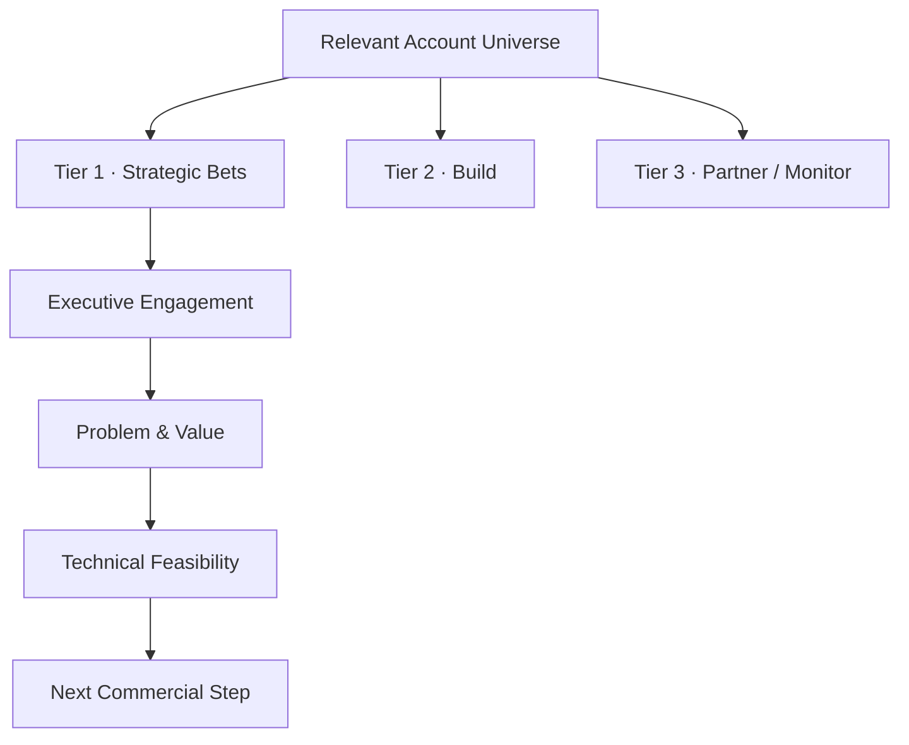
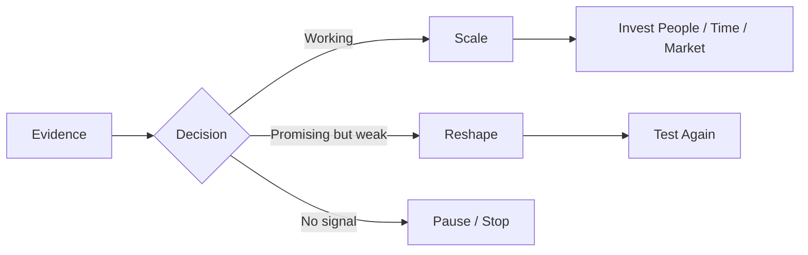
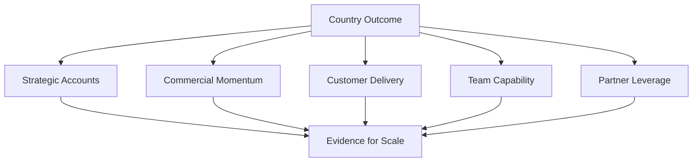

# ILLUSTRATIVE LEADERSHIP EXAMPLE
## How I would approach building an Enterprise AI country business

**Strategy · Strategic Accounts · Commercial Execution · Team · Delivery · Partners · Scale**

> **This is an illustrative leadership example. It shows how I would structure such a mandate; it is not presented as a country-GM project I have already executed.**

---

## My starting point

A country business cannot be built as separate departments that hand work to each other.

For me, the operating system has to connect **market strategy, strategic accounts, commercial decisions, technical credibility, customer delivery and team execution** from the beginning.

The objective would not be maximum activity. It would be to create a **focused, repeatable country motion** in which the strongest customer opportunities receive the right commercial and technical attention — and where successful delivery strengthens the next sale.

---

# First 100 Days

The 100-day plan would answer four progressively harder questions:

1. **Where can we win?**
2. **Where should we focus?**
3. **Can we execute consistently?**
4. **What is already strong enough to scale?**

---

## Days 1–25 · UNDERSTAND
### Build the fact base before accelerating

The first phase would be about learning fast without confusing activity with progress.

### Market
I would establish a practical view of:

- the strongest product / market fit in Germany
- industries and use cases with real urgency and adoption potential
- local buying dynamics and market-specific constraints
- competitive alternatives, including the option for customers to do nothing or build internally
- areas where technical differentiation can create commercial leverage

### Strategic accounts
I would build a prioritized account landscape around questions such as:

- Which accounts matter strategically?
- Where is there a real business problem rather than general AI curiosity?
- Who owns the outcome?
- Is there a credible path to executive sponsorship?
- Can a first successful implementation become a larger relationship?

### Customer delivery
I would understand what successful implementation actually requires:

- typical customer dependencies
- integration and adoption friction
- what can be standardized
- what will remain customer-specific
- where sales commitments create delivery risk
- where implementation quality can become a competitive advantage

### Team and capability
I would assess the existing organization by capability rather than title:

- enterprise sales
- technical solutioning
- implementation / customer delivery
- partner development
- operational coordination

**Day-25 output:**

> **A fact-based country hypothesis: where to play, where not to play, which accounts deserve focus, what customers need to succeed and where the organization has execution gaps.**

---

## Days 26–50 · POSITION
### Turn the fact base into choices

The second phase would reduce complexity. A country strategy becomes useful only when it changes where time, people and investment go.

### Strategic-account architecture

For each priority account, I would want a concise answer to:

- **Why this account?**
- **Why now?**
- **What business problem is worth solving?**
- **Who matters in the decision?**
- **What is the credible first use case?**
- **Can we deliver it successfully?**
- **What is the next customer action?**
- **What could follow if we create value?**

### Country priorities
By day 50, I would want explicit choices around:

- the accounts receiving direct senior attention
- the use cases worth pushing hardest
- the delivery capabilities that need strengthening first
- which partners can materially improve reach or implementation
- which events / market activities deserve investment
- what we consciously **will not** prioritize yet

A large pipeline is not automatically a strong pipeline. I would rather have fewer opportunities with **real customer pain, credible ownership, technical feasibility and a concrete next step** than a large list of names with no momentum.

**Day-50 output:**

> **A visible country focus: prioritized accounts, clear value hypotheses, delivery implications, partner priorities and resource choices.**

---

## Days 51–75 · EXECUTE
### Convert choices into an operating rhythm

This is where the strategy has to survive contact with customers, delivery teams and real constraints.

### Commercial rhythm
I would introduce a disciplined strategic-account cadence focused on:

- customer progress, not internal activity
- explicit next actions and ownership
- decision-maker access
- value and urgency
- technical feasibility before over-committing
- commercial path and timing
- learning from lost or stalled opportunities

### Delivery rhythm
Commercial momentum only matters if customers can be successful after the signature.

I would therefore keep visible:

- implementation readiness
- dependencies and blockers
- customer-side ownership
- time to first usable value
- risks created by customization or integration
- escalation points requiring leadership decisions

### Team
Hiring would follow the real bottleneck rather than an ideal organization chart.

Depending on what the first 50 days reveal, the highest-value capability could be:

- strategic enterprise sales
- technical solution / pre-sales capability
- implementation and customer delivery
- partner development
- operational support for a growing country motion

### Partners and market presence
I would invest in partners, events and external visibility when they support at least one concrete outcome:

1. **access** to strategically relevant accounts
2. **credibility** with buyers and technical stakeholders
3. **delivery leverage** that improves customer success

**Day-75 output:**

> **A working execution system: account cadence, delivery visibility, capability priorities and a direct feedback loop between what is sold and what can be delivered.**

---

## Days 76–100 · PROVE & SCALE
### Decide what deserves more investment

By this stage I would expect enough evidence to distinguish promising hypotheses from repeatable motions.

The key question becomes:

> **What is working strongly enough that we should now scale it — and what should we stop, reshape or deprioritize?**

### Evidence I would look for

#### Strategic accounts
- stronger executive engagement
- validated business problems
- concrete buying or implementation steps
- clearer pathways from first use case to expansion

#### Commercial
- improving quality of qualified opportunities
- movement through decision stages
- better understanding of objections and loss reasons
- early signs of repeatability across accounts or industries

#### Delivery
- reduced ambiguity around implementation
- clearer ownership
- shorter path to customer value
- reusable delivery patterns emerging from real work

#### Team
- critical capability gaps either filled or actively addressed
- clearer decision rights
- fewer hand-off problems between commercial and technical functions

#### Partners
- evidence that selected partners actually create access, credibility or delivery capacity

### Scale decision

**Day-100 output:**

> **A country operating model based on evidence: which accounts, motions, capabilities and partnerships deserve additional investment — and which do not.**

---

# What I would personally own

For a General Manager mandate, I would not treat these as disconnected functions.

| Area | My leadership focus |
|---|---|
| **Country Strategy** | translate global priorities into clear local choices |
| **Strategic Accounts** | stay close to the most important customer conversations and decisions |
| **Commercial Execution** | maintain focus on opportunity quality, progress and outcomes |
| **Customer Delivery** | make sure commercial promises remain connected to implementation reality |
| **Team** | create clarity, hire around critical gaps and remove execution blockers |
| **Partners** | use the ecosystem where it materially improves access or delivery |
| **Market Presence** | represent the business where visibility supports strategic outcomes |

The role should not become a reporting layer above the business. It should remain close enough to customers and teams to improve decisions and remove friction.

---

# Executive view after 100 days

I would want the country view to fit on one page.

| Dimension | What I would want to know |
|---|---|
| **Strategic Accounts** | Are we deeper in the right accounts? |
| **Commercial** | Are opportunities becoming more real and more actionable? |
| **Customer Value** | Do our strongest use cases solve problems customers will fund? |
| **Delivery** | Can we implement what we sell with confidence? |
| **Team** | Do we have the capabilities and decision clarity to execute? |
| **Partners** | Are they creating measurable leverage? |
| **Market** | Are we becoming more relevant to the customers that matter? |
| **Scale** | What evidence justifies the next investment? |

---

## Leadership principle

> ### **Build focus before scale. Stay close to the customer. Connect commercial ambition with technical reality. Use delivery to earn trust — and use evidence to decide where to invest next.**

---

### Public boundary

This example intentionally stays at leadership and operating-model level. It does **not** publish detailed account-selection criteria, customer-specific strategies, pricing logic, negotiation methods, internal sales playbooks, implementation architecture or proprietary execution mechanisms.
