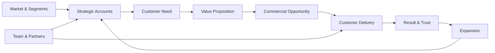
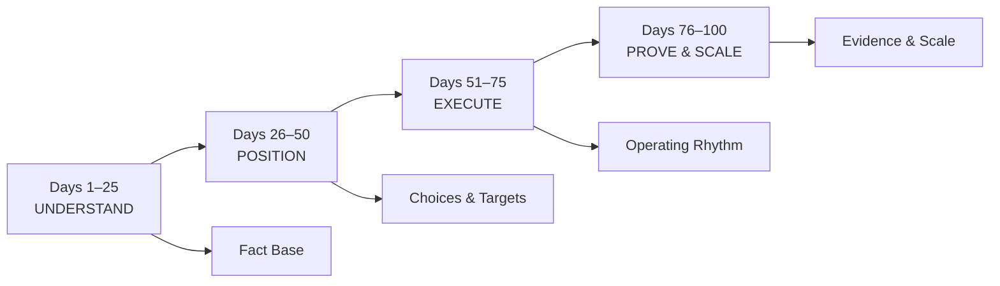
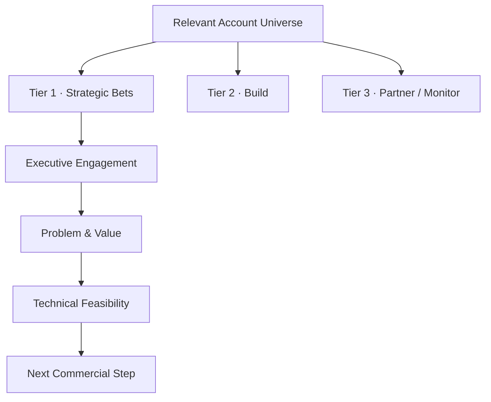
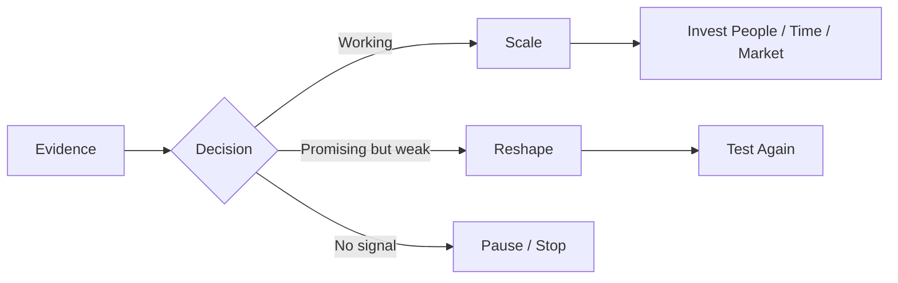
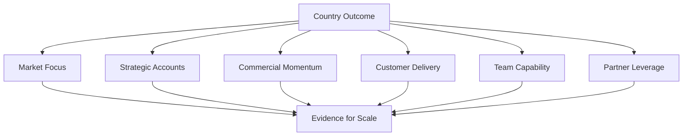

# ILLUSTRATIVE LEADERSHIP EXAMPLE
## How I would approach building an Enterprise AI country business

**Market Strategy · Strategic Accounts · Customer Value · Commercial Execution · Team · Delivery · Partners · Scale**

> **This is an illustrative leadership example. It shows how I would structure such a mandate; it is not presented as a country-GM project I have already executed.**

---

## My starting point

A country business cannot be built as separate functions that hand work to each other.

For me, the operating system has to connect **market strategy, customer value, strategic accounts, commercial decisions, technical credibility, customer delivery, people leadership and measurable outcomes** from the beginning.

The objective would not be maximum activity. It would be to create a **focused, repeatable country motion** in which the right customers receive the right commercial and technical attention — and where successful delivery strengthens future growth.

---

# First 100 Days Operating Blueprint

The 100-day plan would answer four progressively harder questions:

1. **Where can we win?**
2. **Where should we focus?**
3. **Can we execute consistently?**
4. **What is strong enough to scale?**

A fifth question sits behind all four:

> **What should we deliberately not do yet?**

Focus is also a commercial decision.

---

## Days 1–25 · UNDERSTAND
### Build the fact base before accelerating

The first phase would be about learning fast without confusing activity with progress.

### 1 · Clarify mandate, expectations and measures

Before changing the business, I would clarify with global leadership:

- what success in Germany is expected to mean
- strategic priorities and non-negotiables
- decision rights and escalation paths
- existing commitments to customers and partners
- available resources and critical constraints
- the meeting and reporting rhythm

I would translate this into a concise **100-day goalsheet with SMART outcomes** so that expectations are explicit rather than assumed.

### 2 · Segment the market before selecting accounts

I would not begin with a long list of company names. I would first create a practical segmentation of the German opportunity landscape.

Depending on the product, segmentation could consider:

- industry / business model
- company size and enterprise complexity
- use-case relevance
- urgency of the business problem
- technical and integration readiness
- ability to create measurable customer value
- commercial potential
- potential to expand after a successful first implementation

The purpose is simple: **not every technically possible customer is a commercially attractive customer**.

### 3 · Understand the customer value equation

For the most promising segments I would want to understand:

- What is inconvenient, slow, expensive, risky or difficult today?
- Which outcome matters enough for the customer to act?
- Who owns that outcome?
- What does the customer value beyond the technology itself?
- What does adoption cost the customer in time, change effort and integration effort?
- What would make the solution meaningfully better than alternatives or doing nothing?

This keeps the discussion centered on **customer value rather than product features alone**.

### 4 · Understand delivery reality

I would examine what successful implementation actually requires:

- typical enterprise integrations and dependencies
- data, privacy and governance constraints
- customer-side ownership
- adoption friction
- what can be repeatable
- what remains customer-specific
- where sales commitments can create delivery risk
- where implementation quality can become a competitive advantage

### 5 · Assess team and capability

I would assess the existing organization by capability rather than title:

- enterprise / strategic sales
- account development
- technical solutioning
- implementation / customer delivery
- partner development
- operational coordination

I would also spend time listening to the team. KPIs can show **where** performance differs; conversations help explain **why**.

**Day-25 output:**

> **A fact-based country hypothesis: target segments, customer-value themes, strategic account universe, delivery realities, capability gaps and explicit 100-day objectives.**

---

## Days 26–50 · POSITION
### Turn the fact base into commercial choices

A country strategy becomes useful only when it changes where **time, senior attention, people and investment** go.

### 1 · Prioritize strategic accounts

For each priority account I would want a concise answer to:

- **Why this account?**
- **Why now?**
- **What business problem is worth solving?**
- **Who matters in the decision?**
- **What customer value can we credibly create?**
- **What is the first viable use case?**
- **Can we deliver it successfully?**
- **What is the next concrete customer action?**
- **What can expand if the first use case succeeds?**

### 2 · Define the value proposition by segment

I would avoid one generic message for the whole market.

For each priority segment, the value proposition should connect:

**customer problem → differentiated capability → operational impact → economic relevance → adoption path**

The technology matters, but the customer ultimately buys an improvement in their business.

### 3 · Establish commercial objectives

By day 50 I would convert strategy into a small set of explicit targets.

Examples could include:

- priority-account penetration
- qualified opportunity progression
- first customer implementation milestones
- partner activation
- critical hiring milestones

The exact numbers would depend on the actual baseline and company targets.

### 4 · Keep KPI design deliberately small

I prefer a few decision-relevant KPIs over dashboard volume.

For each decision area I would normally select only a small number of indicators that show:

- **input / leading signal** — is the required activity or condition present?
- **conversion / movement** — is the opportunity progressing?
- **outcome** — did it create customer and commercial value?

> **A KPI tells me where to look. It does not replace the leadership decision about what to do.**

### 5 · Make explicit choices

By day 50 I would want clarity on:

- segments receiving priority
- accounts receiving direct senior attention
- use cases worth pushing hardest
- delivery capabilities to strengthen first
- partner types that can materially improve reach or implementation
- market activities that deserve investment
- what we consciously **will not prioritize yet**

A large pipeline is not automatically a strong pipeline. I would rather have fewer opportunities with **real customer pain, credible ownership, technical feasibility and a concrete next step** than a large list of names without momentum.

**Day-50 output:**

> **A visible country position: target segments, priority accounts, segment-specific value hypotheses, SMART commercial objectives, focused KPIs, delivery implications and resource choices.**

---

## Days 51–75 · EXECUTE
### Convert choices into an operating rhythm

This is where strategy has to survive contact with customers, delivery teams and real constraints.

### Commercial rhythm

I would establish a disciplined strategic-account cadence focused on:

- customer progress, not internal activity
- explicit next actions and ownership
- access to the real decision makers
- customer value and urgency
- technical feasibility before over-committing
- commercial path and timing
- learning from stalled and lost opportunities
- follow-up / expansion logic where value is proven

### Customer conversations

The account team should understand not only **what happened**, but what behavior and conditions increase the probability of success.

That means asking:

- Which conversations move opportunities forward?
- Where are we speaking with the wrong level or stakeholder?
- Which objections repeat?
- Which value arguments create engagement?
- Where does technical credibility increase trust?
- Which opportunities should be reshaped rather than pushed?

This turns sales steering into **leadership and coaching**, not just reporting.

### Delivery rhythm

Commercial momentum only matters if customers can be successful after the signature.

I would keep visible:

- implementation readiness
- dependencies and blockers
- customer-side ownership
- time to first usable value
- adoption risks
- customization / integration risks
- escalation points requiring leadership decisions

### Team

I would set clear expectations and let hiring follow the actual bottleneck rather than an ideal organization chart.

Depending on the evidence, the highest-value capability could be:

- strategic enterprise sales
- account development
- technical solution / pre-sales capability
- implementation and customer delivery
- partner development
- operational support for a growing country motion

The leadership task is not simply to set targets. It is to create the **conditions, clarity, capability and accountability** that make performance possible.

### Partners and market presence

I would invest in partners, events and external visibility when they support at least one concrete outcome:

1. **access** to strategically relevant accounts
2. **credibility** with buyers and technical stakeholders
3. **delivery leverage** that improves customer success

**Day-75 output:**

> **A working commercial and delivery system: account cadence, coaching logic, delivery visibility, capability priorities and a direct feedback loop between market response, sales behavior and implementation reality.**

---

## Days 76–100 · PROVE & SCALE
### Use evidence to decide what deserves more investment

By this stage I would expect enough evidence to distinguish promising hypotheses from repeatable motions.

The key question becomes:

> **What is working strongly enough that we should now scale it — and what should we stop, reshape or deprioritize?**

### Evidence I would look for

#### Market & strategic accounts
- target segments showing stronger response than others
- deeper executive engagement in priority accounts
- validated business problems
- concrete buying or implementation steps
- clearer paths from first use case to expansion

#### Commercial
- improving quality of qualified opportunities
- movement through decision stages
- stronger conversion from customer engagement to actionable next step
- better understanding of objections and loss reasons
- early signs of repeatability across accounts or segments

#### Customer value
- clearer evidence that priority use cases matter economically or operationally
- customer willingness to commit resources
- evidence that the proposed value outweighs adoption effort

#### Delivery
- reduced ambiguity around implementation
- clearer ownership
- shorter path to first usable value
- reusable delivery patterns emerging from real work

#### Team
- critical capability gaps filled or actively addressed
- clearer decision rights
- stronger accountability
- fewer hand-off problems between commercial and technical functions

#### Partners
- evidence that selected partners actually create access, credibility or delivery capacity

### Scale decision

**Day-100 output:**

> **An evidence-based country operating model: which segments, accounts, value propositions, sales motions, delivery patterns, capabilities and partnerships deserve additional investment — and which do not.**

---

# What I would personally own

For a General Manager mandate, I would not treat these as disconnected functions.

| Area | My leadership focus |
|---|---|
| **Country Strategy** | translate global priorities into clear local market and segment choices |
| **Strategic Accounts** | stay close to the most important customer conversations and decisions |
| **Customer Value** | ensure the proposition solves problems customers will actually fund |
| **Commercial Execution** | maintain focus on opportunity quality, progress, conversion and account growth |
| **Customer Delivery** | keep commercial promises connected to implementation reality |
| **Team** | set expectations, coach, create clarity, hire around critical gaps and remove blockers |
| **Partners** | use the ecosystem where it materially improves access or delivery |
| **Market Presence** | represent the business where visibility supports strategic outcomes |

The role should not become a reporting layer above the business. It should remain close enough to customers and teams to improve decisions and remove friction.

---

# Executive view after 100 days

I would want the country view to fit on one page and support decisions, not produce reporting for its own sake.

| Dimension | Executive question |
|---|---|
| **Market / Segments** | Are we focusing on the parts of the market with the strongest value and commercial potential? |
| **Strategic Accounts** | Are we deeper in the right accounts and with the right decision makers? |
| **Commercial** | Are qualified opportunities progressing and converting? |
| **Customer Value** | Do our strongest use cases solve problems customers will fund? |
| **Delivery** | Can we implement what we sell with confidence and acceptable time to value? |
| **Team** | Do we have the capabilities, expectations and decision clarity to execute? |
| **Partners** | Are they creating measurable access, credibility or delivery leverage? |
| **Scale** | What evidence justifies the next investment? |

For each dimension I would keep the KPI set deliberately small and connect it to a specific management decision.

---

## Leadership principle

> ### **Segment before you target. Understand value before you sell. Measure what changes decisions. Keep commercial ambition connected to technical reality. Use delivery to earn trust — and evidence to decide where to scale.**

---

### Public boundary

This example intentionally stays at leadership and operating-model level. It does **not** publish detailed account-selection criteria, customer-specific strategies, pricing logic, negotiation methods, internal sales playbooks, implementation architecture, proprietary qualification models or detailed execution mechanisms.
