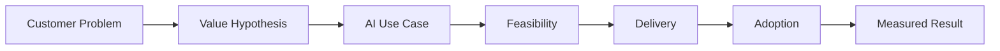
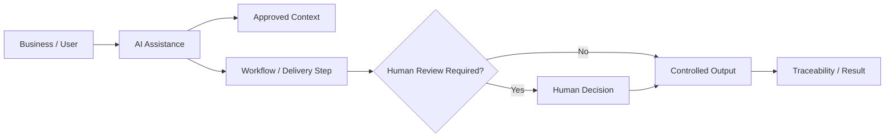
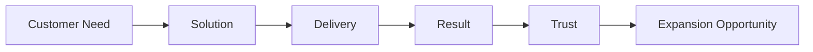

# ILLUSTRATIVE EXAMPLE
## How I would structure an Enterprise AI opportunity

**Customer Need → Value → Technical Feasibility → Delivery → Adoption → Expansion**

> **This is an illustrative example of my working approach. It is not presented as a specific customer engagement or completed production deployment.**

---

## 1 · Start with the customer problem

I would not start with the model or with a list of AI features. I would first clarify:

- What business problem is important enough to solve?
- Who owns the outcome?
- What happens today and where is the friction?
- What would a materially better result look like?
- What must remain under human control?

---

## 2 · Connect business and technology early

Before committing to delivery, I would bring commercial, technical and operational questions together.

| Lens | Key question |
|---|---|
| **Business** | Is the problem worth solving? |
| **Customer** | Who benefits and who decides? |
| **Technology** | Can the required capability and integrations be delivered reliably? |
| **Data / Governance** | What information may be used and where is human approval required? |
| **Delivery** | Is there clear ownership, scope and a realistic path to value? |
| **Commercial** | Is there a credible business case and room to grow if successful? |

The purpose is to avoid two common failures: selling something that cannot be delivered, or building something that has no meaningful business owner.

---

## 3 · Define a focused first use case

I would prefer a first scope that is:

- relevant enough to matter
- narrow enough to control
- measurable
- technically realistic
- connected to an existing process
- able to create evidence for the next decision

The objective of the first implementation is not maximum scope. It is **credible value and learning**.

---

## 4 · Build in human control and traceability

My practical AI work has reinforced the importance of keeping clear boundaries between automation and accountable decisions.

A high-level pattern could look like this:

The exact implementation would depend on the use case, risk and enterprise environment.

---

## 5 · Delivery is part of the commercial relationship

I would keep account and delivery thinking connected throughout the engagement.

A technically successful implementation can strengthen the strategic customer relationship. A poorly delivered promise can destroy it. For that reason, I see technical credibility and customer delivery as part of commercial leadership, not as something that begins only after the sale.

---

## 6 · Measure before expanding

I would not argue for expansion only because the technology is interesting. I would look for evidence such as:

- improved cycle or response time
- reduced manual effort
- better quality or consistency
- user / customer acceptance
- reliable operation
- a credible economic effect

If the evidence is good, the next use case can build on what has already been learned.

---

## Working principle

> **Understand the real problem. Make the value explicit. Keep technology and delivery honest. Prove the result. Then scale.**

---

### Public boundary

This example intentionally does not publish detailed prompts, agent logic, internal architecture, customer qualification methods, pricing logic or proprietary delivery configurations.
