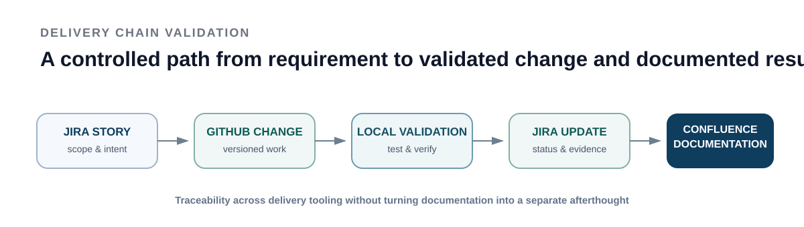

# ProfileHub

## Public project summary

ProfileHub is a separate mini-project I built for a modern personal CV / consulting landing page and as a controlled workspace for validating a delivery chain before applying the pattern to larger agent-driven work.

### Technology

- React
- Vite
- CSS
- GitHub for code versioning
- Jira for delivery execution
- Confluence for documentation and playbook content
- local execution / validation environment

### Delivery flow used

  

### What was validated

- a separate Jira project
- a separate Confluence space
- a separate GitHub repository
- local execution
- a working React/Vite homepage
- delivery notes linked back to the project workflow

### Why it is relevant

ProfileHub gave me a smaller environment in which to validate the interaction between project-management tooling, code versioning, local execution and documentation before applying similar principles to larger projects.

### Public boundary

The detailed workspace configuration, internal project content and private delivery notes are intentionally not reproduced here.
